# 🚀 MIT AI Program Onboarding Guide
*Interactive Summary of Key AI Industry Insights*

---

## 📊 Executive Dashboard

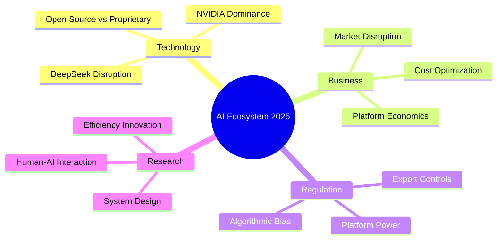

---

## 🎯 Category 1: Technology Breakthroughs

### DeepSeek's Revolutionary Approach

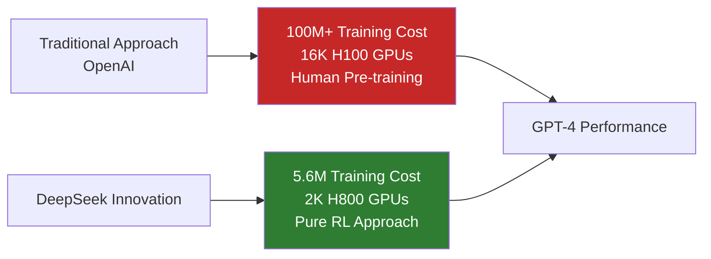

### 🔑 **Top 5 Technical Breakthroughs:**

| Innovation | Impact | Cost Reduction |
|------------|--------|----------------|
| **Mixture of Experts (MoE)** | 37B/671B parameters active | 94% efficiency gain |
| **Pure Reinforcement Learning** | No human pre-training | 80% time reduction |
| **Distillation Techniques** | Teacher-student knowledge transfer | 60% compute savings |
| **H800 Optimization** | Export-restricted hardware efficiency | Works with limited resources |
| **Open Source Strategy** | Global accessibility | 200x API cost reduction |

---

## 🏭 Category 2: Industry Ecosystem

### AI Platform Landscape

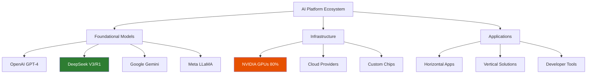

### 📈 **Market Dynamics Timeline:**

```
2020    2022    2024    2025    2030
  |       |       |       |       |
  └─ GPU  └─ ChatGPT └─ DeepSeek └─ Now └─ Future
   Shortage  Launch   Disruption        $1.3T Market
```

---

## ⚙️ Category 3: NVIDIA's Dominance

### NVIDIA's Platform Strategy

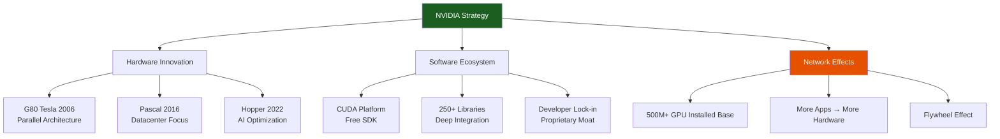

### 💰 **NVIDIA Financial Performance:**

| Metric | 2023 | Growth |
|--------|------|--------|
| **Revenue** | $13.5B quarterly | 100% YoY |
| **Profit** | $6.2B quarterly | 200%+ YoY |
| **Market Cap** | $1T+ | vs $159B AMD |
| **GPU Market Share** | 80% AI workloads | Dominant |

---

## 🔄 Category 4: System Interdependencies

### AI Decision-Making System Model

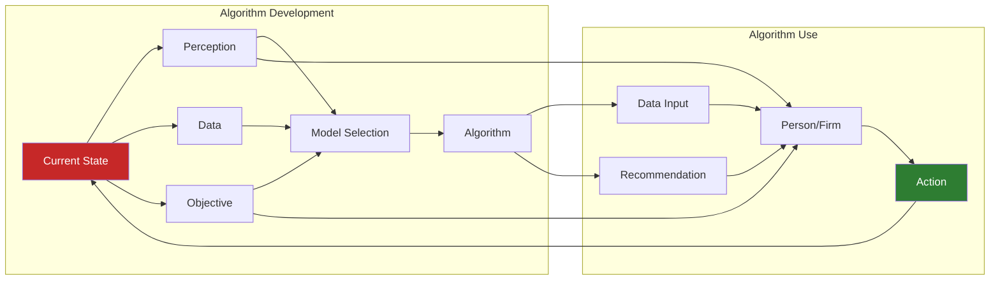

### ⚠️ **Critical System Challenges:**

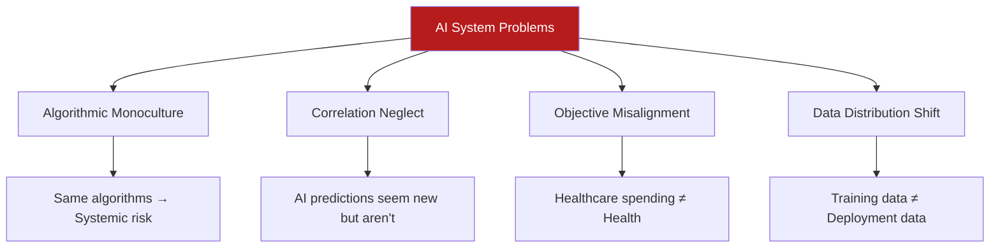

---

## 📊 Category 5: Market Competition

### Competitive Landscape Analysis

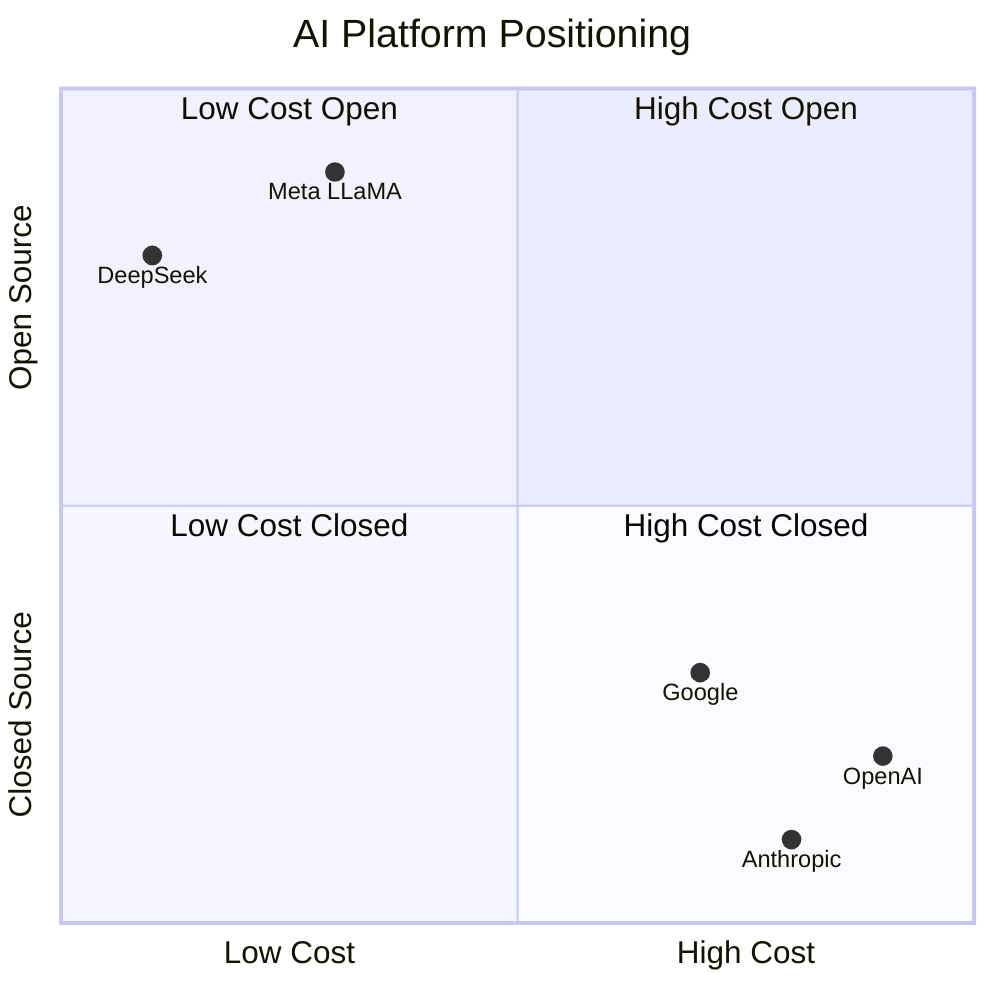

### 🏆 **Competitive Advantages Comparison:**

| Company | Strategy | Strength | Weakness |
|---------|----------|----------|----------|
| **DeepSeek** | Low-cost efficiency | 200x cheaper APIs | Limited resources |
| **OpenAI** | Performance leader | Advanced capabilities | High costs |
| **NVIDIA** | Platform control | Hardware+Software | Dependency risk |
| **Meta** | Open source | Accessibility | Monetization |
| **Google** | Vertical integration | Full stack | Closed ecosystem |

---

## 🔬 Category 6: Research Opportunities

### Emerging Research Areas

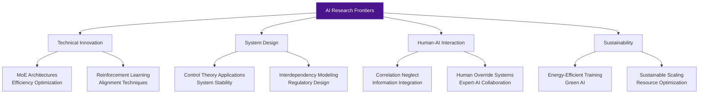

---

## 🌍 Category 7: Geopolitical Implications

### US-China AI Competition

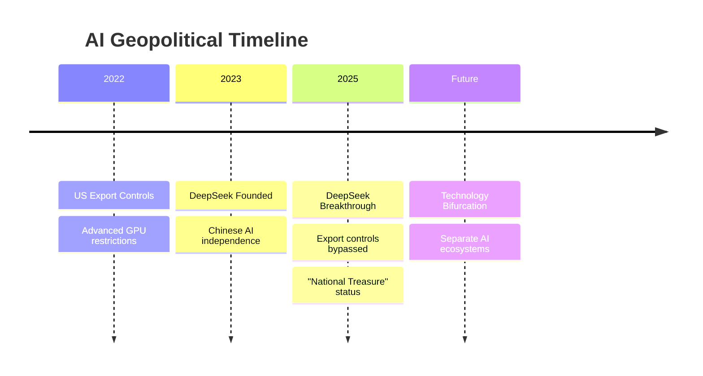

### 🌐 **Global AI Power Balance:**

| Region | Strengths | Market Share | Key Players |
|--------|-----------|--------------|-------------|
| **USA** | Hardware, Investment | 60% | NVIDIA, OpenAI, Google |
| **China** | Efficiency, Innovation | 25% | DeepSeek, Alibaba, Baidu |
| **Europe** | Regulation, Research | 10% | Mistral, FAIR |
| **Others** | Emerging markets | 5% | Various startups |

---

## 🎯 Strategic Insights for MIT Program

### 🔍 **Key Focus Areas:**

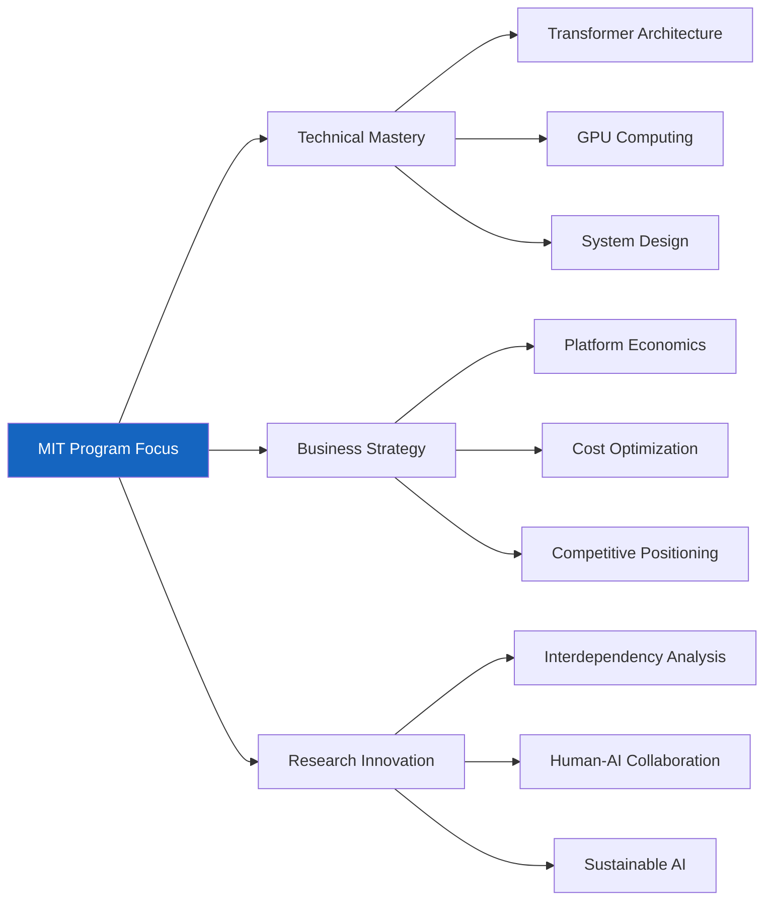

### 📚 **Learning Priorities Matrix:**

| Priority | Technical Skills | Business Skills | Research Skills |
|----------|------------------|-----------------|-----------------|
| **High** | Neural Networks<br/>GPU Programming | Platform Strategy<br/>Cost Analysis | System Modeling<br/>Experimental Design |
| **Medium** | Reinforcement Learning<br/>Model Optimization | Market Dynamics<br/>Regulatory Analysis | Human Factors<br/>Bias Detection |
| **Low** | Hardware Design<br/>Low-level Optimization | Financial Modeling<br/>Legal Frameworks | Social Impact<br/>Policy Design |

---

## 🔮 Future Predictions & Trends

### 5-Year AI Industry Forecast

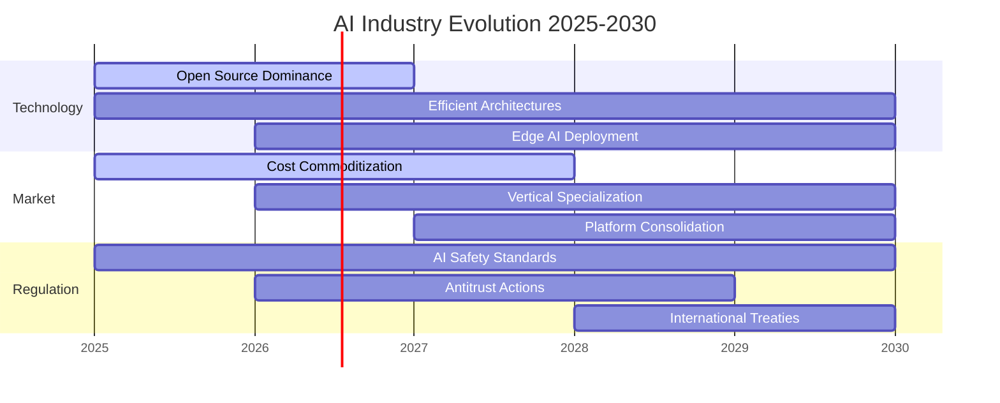

---

## 📝 Action Items for MIT Program

### ✅ **Immediate Next Steps:**

1. **🔬 Technical Foundation**
   - [ ] Master transformer architecture fundamentals
   - [ ] Learn CUDA/GPU programming basics
   - [ ] Understand MoE and distillation techniques

2. **📊 Business Analysis**
   - [ ] Study platform economics theory
   - [ ] Analyze DeepSeek's cost optimization strategies
   - [ ] Research competitive positioning frameworks

3. **🎯 Research Project Ideas**
   - [ ] System interdependency modeling
   - [ ] Human-AI collaboration optimization
   - [ ] Sustainable AI architecture design

4. **🌐 Industry Engagement**
   - [ ] Follow key industry publications
   - [ ] Attend AI conferences and workshops
   - [ ] Network with industry practitioners

---

*This interactive guide synthesizes insights from four key documents covering DeepSeek's breakthrough, generative AI platforms, NVIDIA's dominance, and AI system interdependencies. Use this as your roadmap for navigating the complex AI landscape during your MIT program.*