# 🚀 AI Technology Platform Revolution: Executive Summary
## DeepSeek, Generative AI Innovation, & NVIDIA Ecosystem Analysis

---

## 🎯 **Core Strategic Insights**

## 🔥 **1. DeepSeek: The $5.6M Disruption**

**Revolutionary Achievement**: Chinese startup DeepSeek developed world-class AI models (V3 & R1) for **$5.6M** - disrupting the economics of an industry where competitors spend **$100M-$1B**.

### **🎯 Key Innovations:**
- **Mixture of Experts (MoE)**: Uses specialized models accessing only 37B out of 671B parameters
- **Reinforcement Learning Strategy**: Skipped expensive human pre-training, used self-improvement
- **Distillation Technique**: Large "teacher" models train smaller "student" models efficiently
- **Multi-Token Prediction**: Predicts next two tokens instead of one, improving data efficiency

### **💥 Market Impact:**
- **API Pricing Disruption**: $0.07/M tokens vs OpenAI's $15/M tokens (214x cheaper)
- **Stock Market Shock**: Caused declines in NVIDIA and GenAI infrastructure companies
- **Jevons Paradox Effect**: Lower prices driving massive demand increases, not revenue decreases

---

## 🌟 **2. Generative AI as Innovation Platform**

**Platform Revolution**: GenAI represents a **fundamental shift** from application-centric to platform-centric innovation, similar to how mobile platforms transformed software development.

### **🚀 Platform Characteristics:**

### **🔧 Strategic Implications:**
- **Network Effects**: Value increases exponentially with user base and developer adoption
- **Ecosystem Lock-in**: Platforms create switching costs through integrated toolchains
- **Innovation Acceleration**: Developers build on platform capabilities vs. building from scratch
- **Winner-Take-Most Dynamics**: Leading platforms capture disproportionate value

### **💡 Competitive Advantages:**
1. **Technical Moats**: Advanced model architectures and training techniques
2. **Data Moats**: Proprietary datasets and user-generated training data
3. **Scale Moats**: Computational resources and infrastructure investments
4. **Ecosystem Moats**: Developer communities and application integrations

---

## ⚡ **3. NVIDIA: The AI Infrastructure Monopoly**

**Ecosystem Strategy**: NVIDIA has created an **integrated hardware-software ecosystem** that makes it extremely difficult for competitors to challenge their AI dominance.

### **🏗️ Ecosystem Components:**

```mermaid
graph LR
    A["🔧 CUDA<br/>Software Platform"] --> B["⚡ GPU<br/>Hardware"]
    B --> C["🛠️ Development<br/>Tools"]
    C --> D["🤝 Developer<br/>Community"]
    D --> E["📱 Applications<br/>& Use Cases"]
    E --> A
    
    style A fill:#1a1a2e,stroke:#00ff00,stroke-width:3px,color:#fff
    style B fill:#2d033b,stroke:#00ff00,stroke-width:3px,color:#fff
    style C fill:#810ca8,stroke:#00ff00,stroke-width:3px,color:#fff
    style D fill:#c147e9,stroke:#2d033b,stroke-width:3px,color:#2d033b
    style E fill:#f39c12,stroke:#fff,stroke-width:3px,color:#fff
```

### **🎯 Strategic Moats:**
- **CUDA Lock-in**: 15+ years of developer investment in CUDA ecosystem
- **Performance Leadership**: Consistent hardware performance advantages
- **Software Integration**: Seamless hardware-software optimization
- **Enterprise Relationships**: Deep partnerships with cloud providers and enterprises

### **💰 Market Position:**
- **Revenue Growth**: AI-related revenue grew 1000%+ in key periods
- **Market Share**: 80%+ of AI training workloads
- **Pricing Power**: Premium pricing sustained through performance leadership
- **Ecosystem Effects**: Competitors must match entire ecosystem, not just hardware

---

## 🧭 **Integrated Strategic Framework**

### **🔄 The AI Value Stack Transformation:**

## 🎯 **MIT-Level Strategic Takeaways**

### **1. Platform Economics Rule AI**
- **Winner-take-most dynamics** create massive value concentration
- **Ecosystem strategies** beat individual product strategies
- **Network effects** and **switching costs** determine market leaders

### **2. Cost Innovation Disrupts Incumbents**
- **DeepSeek's 214x cost advantage** challenges fundamental industry assumptions
- **Technical innovation** can overcome resource disadvantages
- **Open source strategies** can compete with closed proprietary models

### **3. Infrastructure Moats Are Deepening**
- **NVIDIA's ecosystem approach** creates multi-layered competitive advantages
- **Hardware-software integration** becomes key differentiator
- **Developer lock-in** more powerful than technology lock-in

### **4. Geopolitical Competition Intensifies**
- **US-China AI competition** driving rapid innovation cycles
- **Export controls** spurring domestic innovation (DeepSeek case)
- **National champion strategies** reshaping global AI landscape

---

## 💡 **Investment & Strategic Implications**

### **🚀 For Startups:**
- **Platform strategies** over standalone applications
- **Cost innovation** can disrupt established players
- **Open source + commercial** hybrid models gaining traction

### **🏢 For Enterprises:**
- **Multi-platform strategies** reduce vendor lock-in risks
- **AI infrastructure decisions** have long-term strategic implications
- **Cost-performance optimization** becoming critical competitive factor

### **💰 For Investors:**
- **Platform companies** command higher valuations and defensibility
- **Infrastructure plays** offer durable competitive advantages
- **Cost disruptors** can rapidly gain market share in commoditizing markets

---

*This analysis synthesizes breakthrough innovations from DeepSeek's cost engineering, platform economics theory from Generative AI research, and ecosystem strategy insights from NVIDIA's market dominance - providing a comprehensive framework for understanding the current AI technology landscape transformation.*