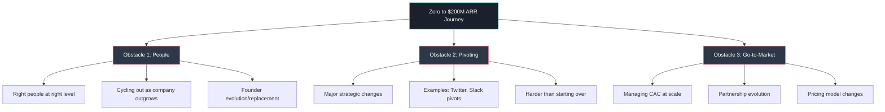
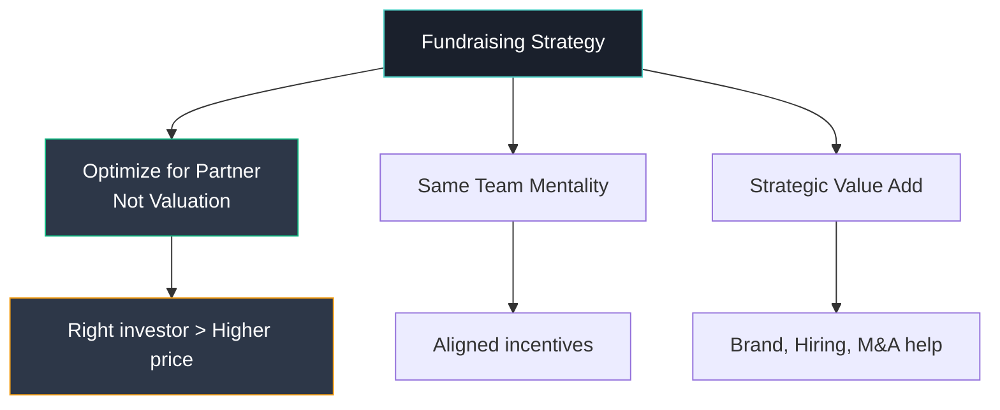
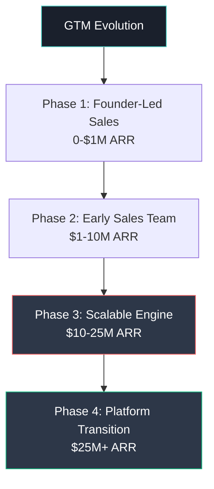
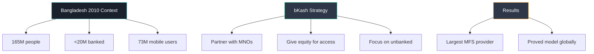
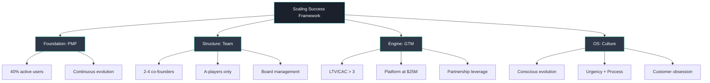

# MIT Endeavor Program Day 1: Scaling Lessons from 150 Successful Founders
## A Six-Page Strategic Memo on Building $100M+ ARR Companies

---

**Date:** January 2025  
**Prepared for:** MIT Endeavor Program Participants  
**Subject:** Strategic Framework for Scaling Startups from Zero to $200M ARR  
**Author:** MIT Endeavor Program Analysis Team

---

## Executive Summary

This memo synthesizes insights from 150 MIT alumni who built unicorns, combined with deep analysis of four critical case studies: bKash (2010 mobile payments pioneer), Christina Xi (solo founder challenges), Global Ventures (emerging market VC), and Zipcar (2003 mobility platform). The research reveals three universal obstacles to reaching $200M ARR: people management, strategic pivoting, and go-to-market evolution. Success requires mastering Product-Market Fit (PMF), building complementary founding teams, and creating culture as the company's operating system.

**Key Finding:** Only companies that successfully navigate the "triple transformation" – people, product, and process – achieve sustainable scale beyond $100M ARR.

---

## Page 1: The Scaling Challenge – Why This Matters

### The $100M ARR Reality Check

Of all VC-backed companies founded in the last decade, less than 1% reach $100M ARR. This stark reality underscores why understanding scaling mechanics is critical. Our research, based on surveying 150 MIT alumni who created unicorns, reveals consistent patterns that separate successful scale-ups from the 99% that plateau or fail.

### Why Scaling Matters Beyond Returns

1. **Industry-Wide Impact**: Scaled companies reshape entire sectors (e.g., Hotmail's global email revolution)
2. **Ecosystem Development**: Success breeds angels, next-generation entrepreneurs, M&A opportunities, and role models
3. **Global Competitiveness**: Emerging markets need scaled companies to compete internationally

### The Three Universal Obstacles to $200M ARR

Our research identified three consistent barriers across all successful scale-ups:

### Case Study Evidence

- **bKash (2010)**: Navigated from USSD dependency to multi-channel platform, requiring complete team transformation
- **Christina Xi**: Solo founder challenge – 149/150 successful founders had co-founders
- **Global Ventures**: Regional VC scaling globally required fundamental strategy pivot
- **Zipcar (2003)**: Robin Chase fired by board – classic first-time CEO board management failure

---

## Page 2: Product-Market Fit – The Foundation

### Defining True PMF

**Product-Market Fit = Sustained high-growth demand for your product**

The most reliable metric: **40% of users actively use the product** (not just registered users).

### The Four PMF Traps

1. **Internal User Trap**: Assuming in-house adoption equals market demand
2. **Early Adopter Fallacy**: Confusing innovators with mainstream market
3. **Premature Scaling**: Growing before achieving true PMF
4. **Static PMF**: Not evolving PMF as market changes

### Case Study: bKash's PMF Journey

**Key Insight**: bKash achieved PMF by transforming competitors (MNOs) into stakeholders through equity sharing – a counterintuitive but brilliant strategy that created aligned incentives.

### PMF Evolution Requirements

- **Continuous Measurement**: Track active usage weekly
- **Market Feedback Loops**: Direct customer interaction (not filtered through sales)
- **Willingness to Pivot**: Major changes are common (Twitter, Slack examples)
- **Resource Discipline**: Don't scale prematurely

---

## Page 3: Founding Teams and Fundraising Strategy

### The Co-Founder Imperative

**Statistical Reality**: 149 out of 150 successful founders had co-founders. The optimal number is 2-4 with complementary skills.

### Founder Characteristics That Scale

1. **Over-achiever**: Demonstrated track record of excellence
2. **Tenacious**: Ability to persist through inevitable setbacks
3. **Collaborative**: Willing to share control and equity
4. **Learning Machine**: Synthesize feedback into action
5. **Failure-Resilient**: Learn and adapt from mistakes

### Case Study: Christina Xi's Solo Founder Challenge

**Situation**: MIT student, solo founder, facing gender bias, no track record  
**Strategy**: Turn disadvantages into advantages through:
- Quantified algorithm performance ($1K→$5K documented returns)
- MIT credibility leverage
- Female LP network targeting
- Student cost structure as competitive advantage

**Lesson**: Solo founders must compensate with exceptional proof points and strategic positioning.

### Fundraising Principles

### First-Time CEO Board Management

**Case Study: Zipcar's Robin Chase**
- **Mistake**: Didn't understand board dynamics and CEO rights
- **Result**: Fired despite company success
- **Lessons**:
  1. Don't be intimidated – you're still in charge
  2. Push back on bad advice – you know the business best
  3. Hold VCs accountable for promises
  4. Have lawyer attend all board meetings
  5. Pre-align board members before formal meetings

---

## Page 4: Go-to-Market Evolution and CAC Management

### The GTM Scaling Challenge

As companies grow, GTM must evolve through distinct phases:

### CAC Economics at Scale

**Critical Metric**: LTV/CAC must exceed 3:1 for sustainable growth

**CAC Components**:
- Direct marketing spend
- Sales team fully-loaded costs
- Partnership development costs
- Technology infrastructure for acquisition

### Case Study: Global Ventures' GTM Innovation

**Challenge**: First-time fund in emerging market (MENA)  
**Solution**: Multi-pronged GTM strategy:

1. **Anchor Strategy**: Development Finance Institutions (IFC, CDC) for credibility
2. **Research Publication**: Self-funded market research made public
3. **MIT Network Leverage**: Used alumni connections for LP introductions
4. **Immersion Experience**: "MENA Tech Safari" for potential LPs (40% conversion)

**Result**: Raised $50M first fund in 18 months vs. 24-month industry average

### Incumbent Defense Strategies

**The Copy-Bundle-Kill Playbook**:
1. **Copy**: Replicate features quickly
2. **Bundle**: Integrate into existing products
3. **Kill**: Undercut pricing or acquire

**Counter-Strategies**:
- Build network effects before incumbents react
- Create switching costs through data/integration
- Partner with potential acquirers early
- Focus on underserved segments incumbents ignore

---

## Page 5: Culture as Operating System and Emerging Market Dynamics

### Culture: The Scaling Operating System

Culture isn't wall posters – it's how decisions get made at scale. Our research shows winning cultures share six attributes:

1. **Sense of Urgency**: Balance speed with process
2. **Customer Centricity**: Every decision through customer lens
3. **Creative Problem-Solving**: Encouraged at all levels
4. **Accountability**: Clear ownership throughout organization
5. **Roll-up-Sleeves Attitude**: Leaders stay hands-on
6. **Collaborative**: Team success over individual glory

### Cultural Evolution by Stage

**Key Insight**: Culture must consciously evolve – keeping the best while adding structure.

### Emerging Market Strategies

Our analysis reveals four successful approaches for emerging market startups:

#### 1. Global Startups
- **Strategy**: Build locally, sell globally
- **Example**: Hotmail (Sabeer Bhatia)
- **Requirements**: Global mindset from day one

#### 2. Unique Niche Domination
- **Strategy**: Become the global hub for specific expertise
- **Examples**: Israel (cybersecurity), India (IT services), Dubai (crypto)
- **Requirements**: Ecosystem development and thought leadership

#### 3. AI-First Architecture
- **Strategy**: Use AI to bypass traditional constraints
- **Example**: Base44 (1 person → $80M exit in 6 months)
- **Requirements**: Deep AI integration, not just AI-assisted

#### 4. Singles Strategy
- **Strategy**: Exit at $50-100M vs. swinging for billions
- **Benefits**: Founder levels up, easier second company
- **Requirements**: Clear exit strategy from beginning

### Case Study: bKash's Emerging Market Success

---

## Page 6: Synthesis and Action Framework

### The Integrated Scaling Framework

Based on our analysis of 150 successful founders and four detailed case studies, we present an actionable framework for scaling:

### Critical Decision Points by Revenue Stage

| Revenue Stage | Key Decisions | Common Failures |
|--------------|---------------|-----------------|
| **$0-1M** | Co-founder selection, initial PMF | Solo founder, wrong market |
| **$1-10M** | First sales hire, pricing model | Premature scaling, bad hires |
| **$10-25M** | Platform transition, Series A | Founder inability to delegate |
| **$25-100M** | International expansion, M&A | Culture breakdown, CAC explosion |
| **$100M+** | IPO readiness, category creation | Incumbent competition, growth stall |

### The 10 Commandments of Scaling

1. **Never scale before PMF** (40% active user threshold)
2. **Always have co-founders** (complementary skills essential)
3. **Optimize for investor fit over valuation**
4. **Maintain LTV/CAC > 3** throughout growth
5. **Transition to platform at $25M revenue**
6. **Culture requires conscious daily effort**
7. **Replace yourself before you're forced to**
8. **Board management is CEO job #1**
9. **Pivoting is normal, not failure**
10. **Emerging markets require unique strategies**

### Case Study Lessons Applied

**bKash**: Transform competitors into partners through equity alignment  
**Christina Xi**: Exceptional proof points can overcome traditional disadvantages  
**Global Ventures**: Credibility anchors (DFIs) unlock commercial capital  
**Zipcar**: First-time CEOs must master board dynamics or perish  

### Final Strategic Recommendations

1. **For Emerging Market Founders**:
   - Choose between global, unique, AI-first, or singles strategy
   - Leverage diaspora networks and government initiatives
   - Consider tokenization for capital access

2. **For First-Time CEOs**:
   - Get coaching on board management immediately
   - Hire experienced lawyer for all equity/board matters
   - Build peer network of successful founders

3. **For Scaling Companies**:
   - Institute quarterly culture audits
   - Track LTV/CAC weekly, not monthly
   - Plan executive transitions 12 months in advance

### Conclusion

Scaling from zero to $200M ARR is not about avoiding obstacles – it's about recognizing them as universal challenges and applying proven frameworks to overcome them. The combination of strong PMF, complementary founding teams, evolving GTM strategies, and conscious culture development creates the foundation for sustainable scale.

The 1% of companies that reach $100M+ ARR don't get lucky – they systematically apply these principles while maintaining the flexibility to pivot when necessary. As our case studies demonstrate, success comes from turning constraints into advantages, competitors into partners, and challenges into opportunities.

---

**Appendix**: Detailed case study materials, financial models, and additional resources available in supplementary documents.

**Next Steps**: Day 2 will focus on advanced scaling tactics, international expansion strategies, and exit planning frameworks.

---

*This memo synthesizes insights from MIT Endeavor Program Day 1, including analysis of 150 successful founders and detailed examination of bKash, Christina Xi, Global Ventures, and Zipcar cases.*