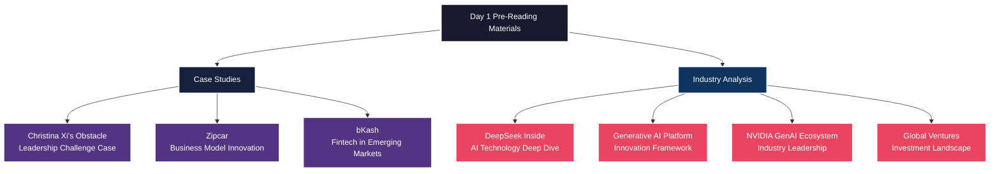
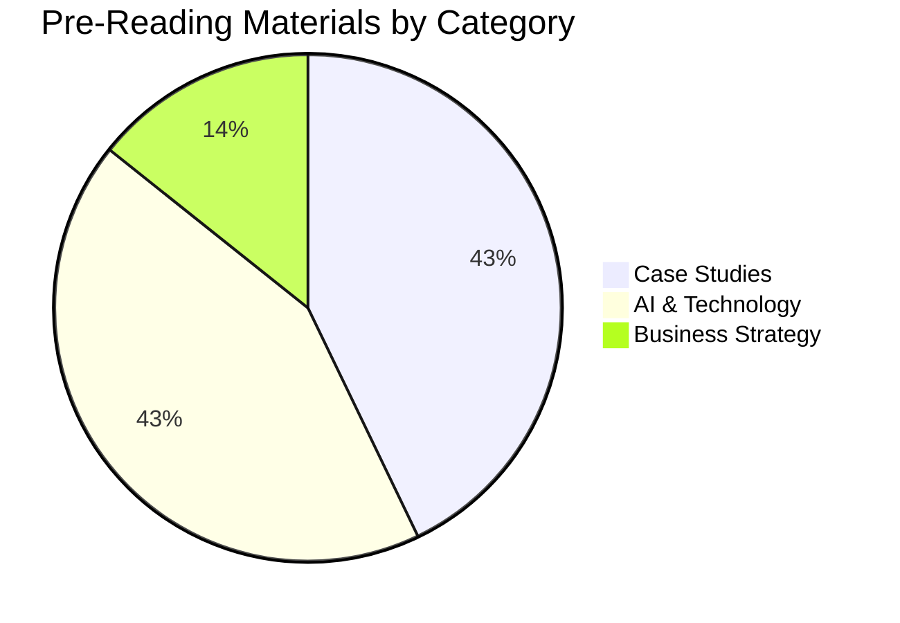
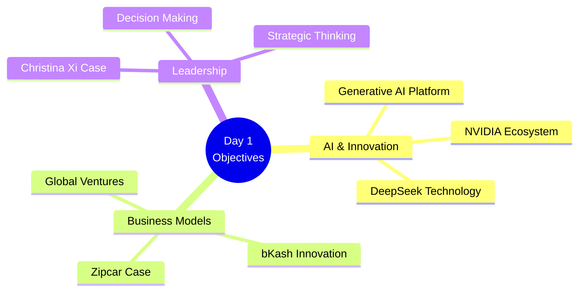

# Day 1 Pre-Reading Materials Overview
## MIT Endeavor Program

### 📚 Available Pre-Reading Materials

### 📊 Materials Distribution

### 📋 Material Summary

| Document | Type | Key Focus Areas |
|----------|------|-----------------|
| **Christina Xi's Obstacle** | Leadership Case | • Leadership challenges • Decision-making under pressure • Personal growth |
| **Zipcar** | Business Model Case | • Sharing economy pioneer • Scalable business models • Urban mobility innovation |
| **bKash** | Fintech Case | • Financial inclusion • Mobile payments • Emerging market strategy |
| **DeepSeek Inside** | Technical Analysis | • AI architecture • Deep learning insights • Technical implementation |
| **Generative AI Platform** | Framework Study | • AI as innovation platform • Strategic opportunities • Implementation roadmap |
| **NVIDIA GenAI Ecosystem** | Industry Analysis | • Ecosystem leadership • AI infrastructure • Market positioning |
| **Global Ventures** | Investment Overview | • Venture landscape • Investment trends • Global opportunities |

### 🎯 Learning Objectives Alignment

### 📝 Pre-Work Questions to Consider

Based on the materials, reflect on:

1. **Innovation Strategy**: How can generative AI transform your business model?
2. **Leadership Challenges**: What obstacles do you face similar to Christina Xi's case?
3. **Market Expansion**: What lessons from bKash apply to emerging markets?
4. **Business Model Innovation**: How can sharing economy principles (Zipcar) apply to your venture?
5. **Technology Investment**: What infrastructure (NVIDIA case) is critical for AI adoption?

### 🔄 Recommended Reading Sequence

```mermaid
graph LR
    A["1. Global Ventures<br/>Context Setting"] --> B["2. Generative AI Platform<br/>Framework"]
    B --> C["3. NVIDIA Ecosystem<br/>Infrastructure"]
    C --> D["4. DeepSeek<br/>Technical Deep Dive"]
    D --> E["5. Business Cases<br/>Zipcar, bKash"]
    E --> F["6. Christina Xi<br/>Leadership Reflection"]
    
    style A fill:#2d033b,stroke:#fff,color:#fff
    style B fill:#810ca8,stroke:#fff,color:#fff
    style C fill:#c147e9,stroke:#fff,color:#fff
    style D fill:#e5b8f4,stroke:#2d033b,color:#2d033b
    style E fill:#f39c12,stroke:#fff,color:#fff
    style F fill:#e74c3c,stroke:#fff,color:#fff
```

---

*Note: Student notes (.md files) have not been added yet. This overview will be updated as notes are created during the sessions.*

**Next Steps:**
- Add session notes in markdown format
- Cross-reference with pre-reading materials
- Generate comprehensive answers to pre-work questions
- Create Amazon 6-pager memo format summary at program completion