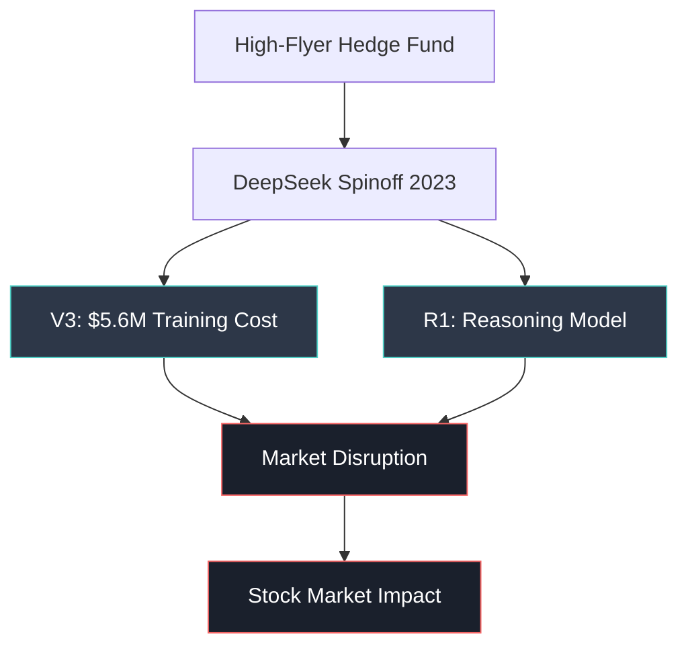
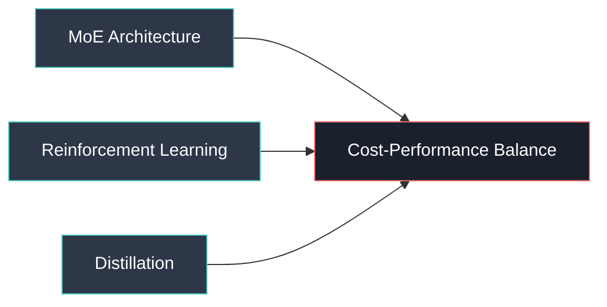
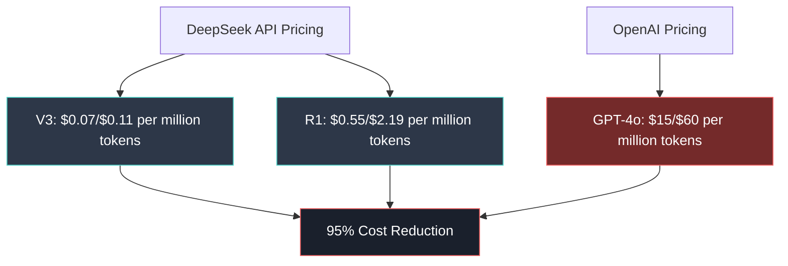

# DeepSeek Inside: Executive Summary

## 🔑 Key Breakthrough
**DeepSeek V3 & R1** disrupted GenAI economics by achieving **comparable performance** to GPT-4 at **$5.6M training cost** vs OpenAI's **$100M+** - a **95% cost reduction**.

## 🏢 Company Origins
- **Parent**: High-Flyer Capital (2015) - AI-powered quantitative hedge fund
- **Founder**: Liang Wenfeng, Zhejiang University graduate
- **Team Size**: 200 employees vs OpenAI's 3,500+
- **Strategy**: Created separate AI research team to evade regulatory scrutiny

## 💡 Technology Innovations

### Three Core Strategies

1. **Mixture of Experts (MoE)**: 37B/671B parameters - access only relevant subsets
   - *Strategic Note*: Instead of using ALL parameters for every calculation (like GPT-4's 1.8T parameters), MoE selectively uses only the most relevant subset - achieving similar performance with much lower computational overhead
   - *Business Implication*: Margin of error becomes less critical since most LLM usage is for assistance with human review, making DeepSeek's cost-efficiency highly attractive for practical applications

2. **Reinforcement Learning (RL)**: Skip human pre-training, learn through rewards
   - *Technical Approach*: DeepSeek uses trial-and-error learning with reward feedback rather than expensive human-labeled datasets
   - *Cost Innovation*: Traditional supervised learning requires massive human annotation ($$$), while RL learns autonomously through environmental interaction
   - *DeepSeek Advantage*: Combined RL with Chain-of-Thought (CoT) reasoning to develop R1's sophisticated problem-solving capabilities
   - *Strategic Note*: This mirrors how humans learn chess - given basic rules, then improving through playing matches rather than studying grandmaster annotations

3. **Distillation**: Transfer knowledge from larger to smaller models  
   - *Process*: Large "teacher" model transfers learned patterns to smaller "student" model without requiring full retraining
   - *Efficiency Gain*: Student model achieves 80-90% of teacher performance with 10x fewer parameters and faster inference
   - *DeepSeek Implementation*: Used V3 as teacher to enhance R1's reasoning capabilities, and created smaller distilled versions from open-source models (Llama 3, Qwen 2.5)
   - *Business Value*: Enables deployment on edge devices and reduces operational costs while maintaining quality

### Training Efficiency
- **V3**: 2.788M hours on 2,000 H800 GPUs at $2/hour
- **GPT-4**: 16,000 H100 GPUs, $100M+ cost
- **Data**: 14.8T tokens (2x more than GPT-4's estimated 6.5T)

## 📊 Market Impact

### Pricing Revolution

### Performance Benchmarks
- **V3**: Comparable to GPT-4o, Claude 3.5, Llama 3.1
- **R1**: 3rd place on Chatbot Arena (matching ChatGPT-4o)
- **Applications**: Adopted by Tencent, Baidu, Huawei, AMD

## 🌊 Strategic Implications

### Disruption Factors
1. **Economic**: Commoditization of GenAI technology
2. **Technical**: Open-source approach vs proprietary models  
3. **Geopolitical**: Chinese AI advancement despite US export controls
4. **Market**: Validated cost-efficient alternative to Silicon Valley approach

### Industry Response
- **Stock Impact**: Major declines in AI infrastructure companies
- **Adoption**: All major cloud providers now support DeepSeek
- **Competition**: Forces industry-wide cost optimization

## 🔮 Future Outlook

**Key Question**: Will this trigger **Jevons Paradox** where lower costs drive higher demand, or genuine market commoditization?

**Critical Success Factor**: Balance between engineering efficiency and continued innovation boundaries in reasoning capabilities.

---
*Executive Summary prepared for MIT Endeavor Program | Focus: Strategic disruption in AI ecosystem economics*