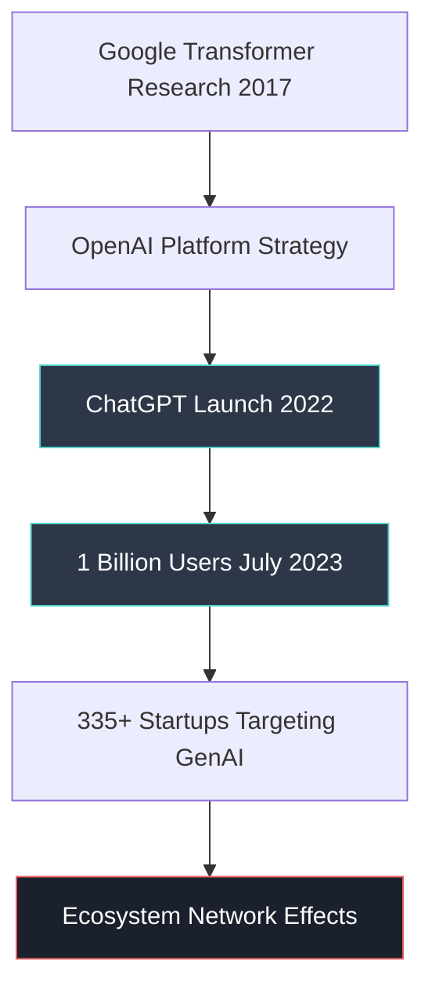
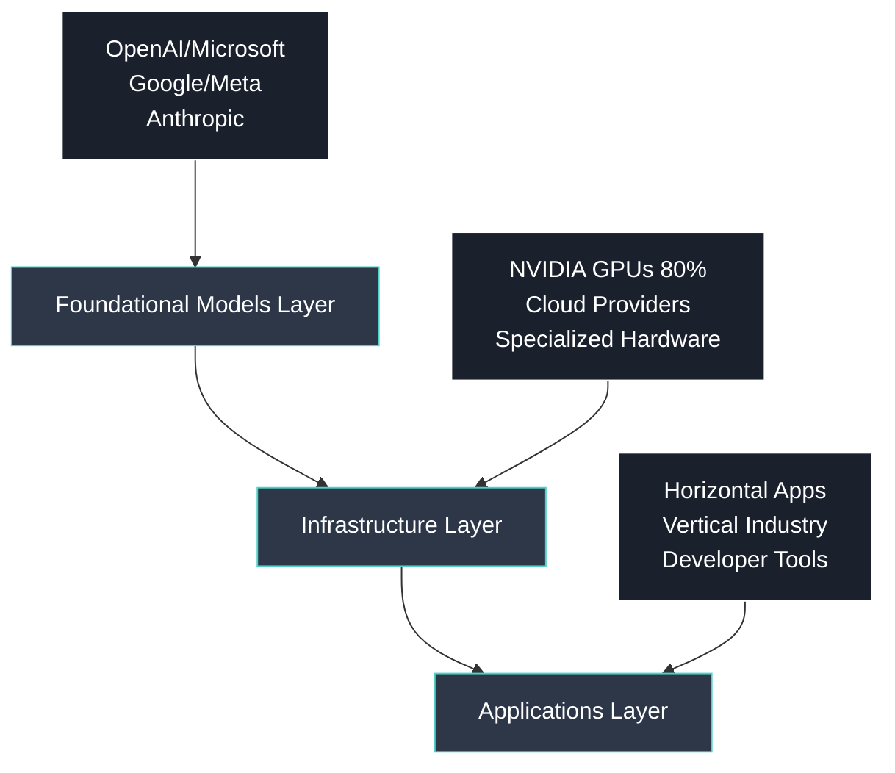
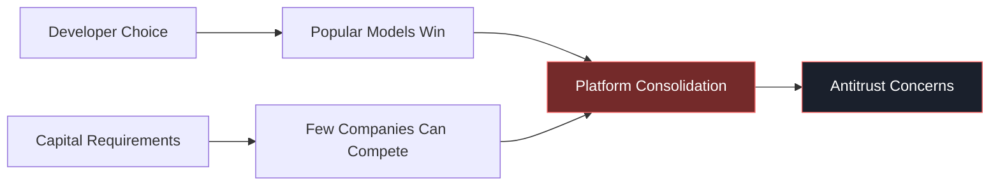
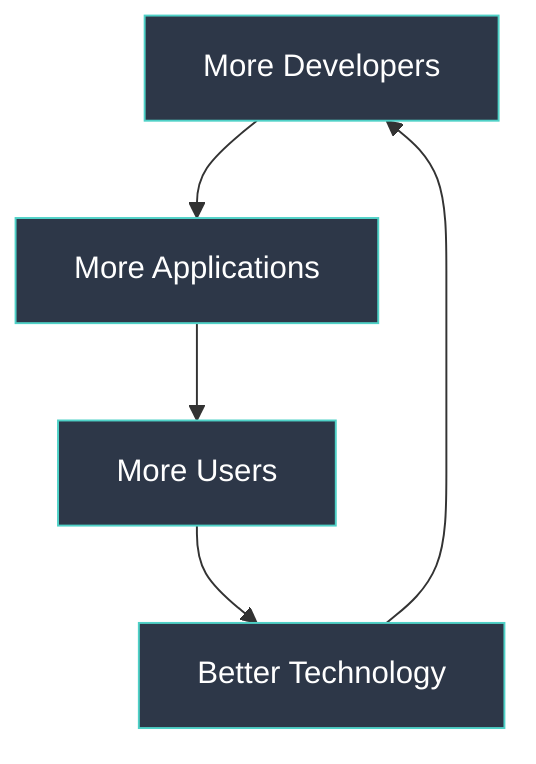

# Generative AI as a New Innovation Platform: Executive Summary

## 🚀 Platform Emergence
**Generative AI** has evolved from experimental technology to a **$40B market (2022)** projected to reach **$1.3 trillion over next 10 years**, establishing itself as the next major innovation platform after PC, smartphone, and cloud computing.

## 🏗️ Ecosystem Architecture

### Three-Layer Structure

### 1. Foundational Models (LLMs)
- **Leaders**: OpenAI (ChatGPT), Google (Bard), Meta (LLaMA 2)
- **Competition**: Unlike PC/smartphone OS, multiple competing models
- **Network Effects**: Application compatibility driving winner-take-most dynamics

### 2. Infrastructure Layer  
- **Hardware**: NVIDIA dominates with **80% GPU market share** for AI
- **Cloud**: AWS, Microsoft Azure, Google Cloud racing to support LLMs
- **Economics**: Massive computing resources required, trillion-dollar datacenter market

### 3. Applications Layer
- **Horizontal**: Microsoft 365 Copilot, Google search integration
- **Vertical**: Industry-specific solutions (healthcare, finance, legal)
- **Developer Tools**: 335+ startups creating specialized applications

## ⚠️ Critical Challenges

### Market Concentration Risks

### Regulatory Concerns
1. **Content Ownership**: "Fair use" of training data - trillion-dollar legal question
2. **Information Accuracy**: Hallucinations and misinformation spread
3. **Privacy**: Data usage without consent, bias in algorithms
4. **Environmental Impact**: Exponential energy consumption growth

## 📈 Platform Network Effects

### Self-Reinforcing Growth Loops

**Key Success Factors**:
- API accessibility driving developer adoption
- Cross-platform compatibility reducing switching costs  
- Continuous model improvements attracting more users

## 🌍 Market Impact Analysis

### Industry Transformation
- **Search Engines**: Microsoft Bing, Google integrating LLMs
- **Productivity**: Microsoft 365 Copilot plugins connecting business apps
- **Creative Industries**: Text, image, audio, video generation tools
- **Vertical Markets**: Manufacturing, gaming, healthcare, finance, education

### Competitive Dynamics
- **Open vs Closed**: Meta's LLaMA 2 vs proprietary models
- **Cost Structure**: Cloud computing resources as competitive advantage
- **Switching Costs**: CUDA-like lock-in effects emerging in AI software

## 🔮 Strategic Implications

### Platform Sustainability Factors
1. **Technology Evolution**: Rapid advancement requiring continuous R&D investment
2. **Regulatory Response**: Need for industry self-regulation + government oversight
3. **Market Structure**: Trend toward oligopoly with few dominant players
4. **Economic Model**: Shift from hardware sales to cloud service revenues

### Critical Success Requirements
- **Scale Economics**: Only largest players can fund model development
- **Developer Ecosystem**: API adoption driving platform lock-in
- **Regulatory Navigation**: Balance innovation with societal responsibility

## 📊 Investment Outlook

**Market Opportunity**: $1.3 trillion projected growth represents **new economic paradigm** similar to Internet/mobile platform disruptions.

**Risk Factors**: Regulatory backlash, environmental constraints, market consolidation limiting competition.

---
*Executive Summary prepared for MIT Endeavor Program | Focus: Platform strategy and ecosystem dynamics in emerging AI market*