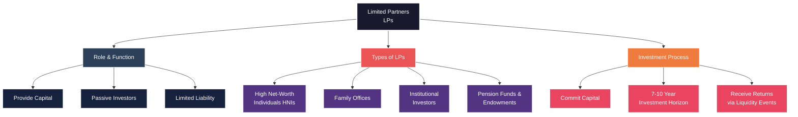
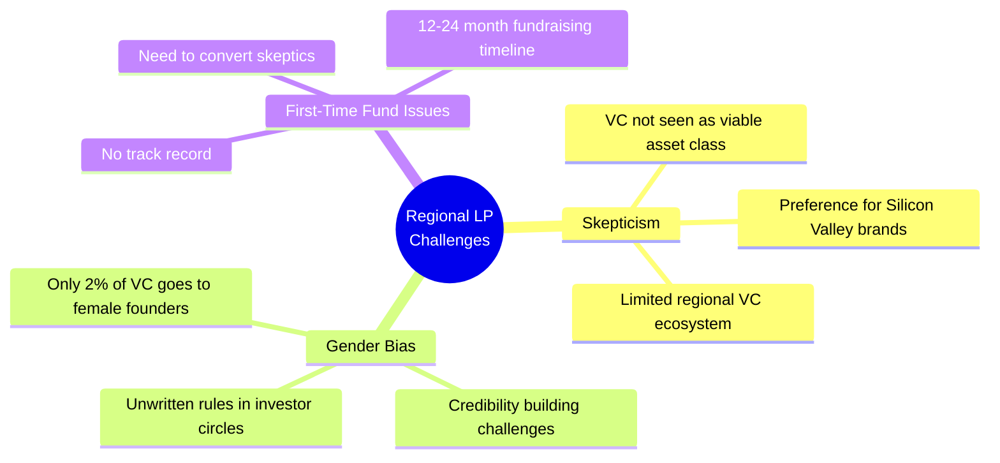
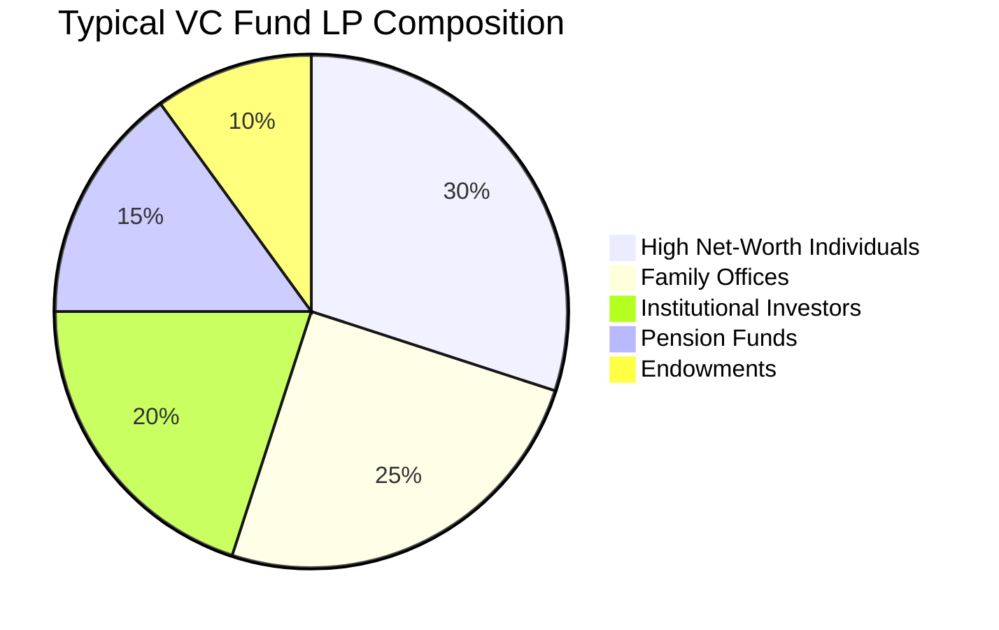

# Global Ventures Case Study: Understanding Limited Partners (LPs)

## 📚 What is an LP (Limited Partner)?

Based on the Global Ventures case and additional research, here's a comprehensive understanding of Limited Partners in the venture capital context:

## 🎯 LP Definition in Venture Capital

**Limited Partners (LPs)** are investors who provide capital to venture capital funds but maintain a passive role in fund management. They are called "limited" because:
- Their liability is limited to their investment amount
- They have limited involvement in day-to-day operations
- They delegate investment decisions to General Partners (GPs)

## 💼 Key Challenges from Global Ventures Case

The protagonist faced three major LP-related challenges in 2018:

### 1. **Regional LP Mindset**

### 2. **Global vs Regional LP Perspectives**

| **Regional LPs (Middle East/Africa)** | **Global LPs (US/International)** |
|----------------------------------------|------------------------------------|
| Reserved capital for Silicon Valley brands | Unfamiliar with MENA region |
| Didn't view regional VC as viable | Lacked reliable regional data |
| HNIs and family offices dominant | Regulatory concerns |
| Relationship-driven decisions | Data-driven decisions |
| Required local credibility building | Required ecosystem education |

### 3. **LP Engagement Timeline**

## 📊 LP Investment Structure

## 🔑 Key Insights for the Case

### Why LPs Matter
1. **Capital Source**: LPs provide 99% of fund capital typically
2. **Validation**: LP commitments signal fund credibility
3. **Network Effect**: LPs can introduce other potential investors
4. **Long-term Partners**: 7-10 year relationships require trust

### Strategic Considerations
- **First-time fund managers** must overcome lack of track record
- **Regional dynamics** significantly impact LP receptiveness
- **Gender bias** creates additional barriers for female GPs
- **Education requirement** for emerging market opportunities

## 💡 Case Question Response Framework

When addressing "What would you have done to initiate and move ahead successfully?":

1. **Build LP-Ready Credibility**
   - Document investment thesis with data
   - Create track record through angel investments
   - Partner with established advisors

2. **Segment LP Approach**
   - Start with mission-aligned investors
   - Target development finance institutions
   - Leverage gender-lens investing trend

3. **Overcome Regional Barriers**
   - Create compelling data room
   - Facilitate LP site visits
   - Showcase portfolio pipeline

4. **Accelerate Timeline**
   - Run parallel LP conversations
   - Set clear commitment deadlines
   - Consider anchor investor strategy

---

*This analysis connects the Global Ventures case study with broader LP dynamics in venture capital, highlighting the specific challenges faced when raising a first-time fund in emerging markets.*