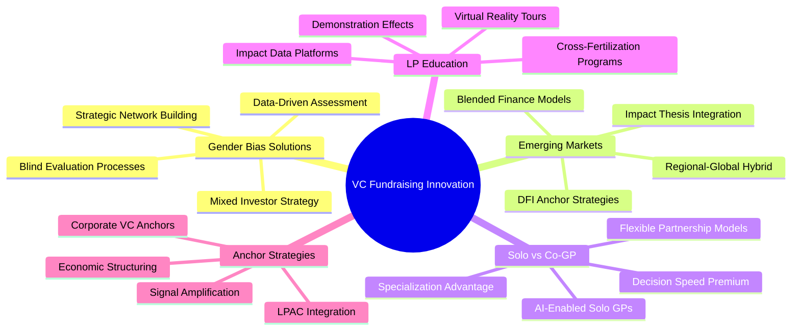
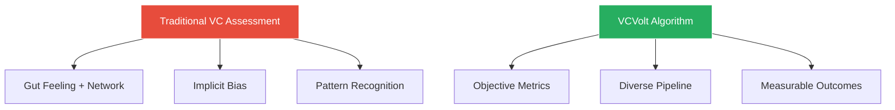
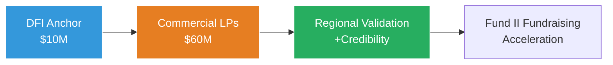
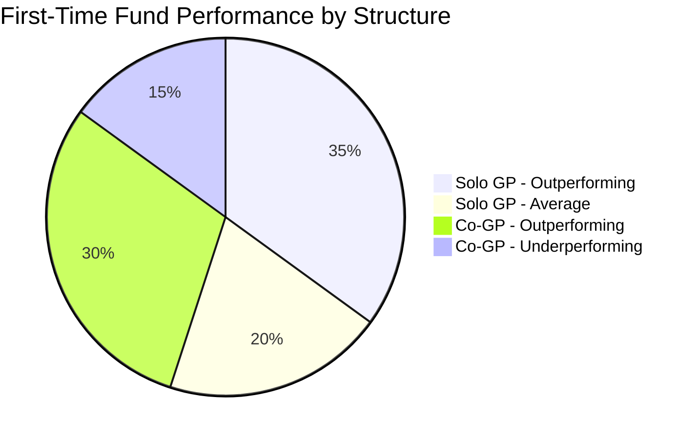
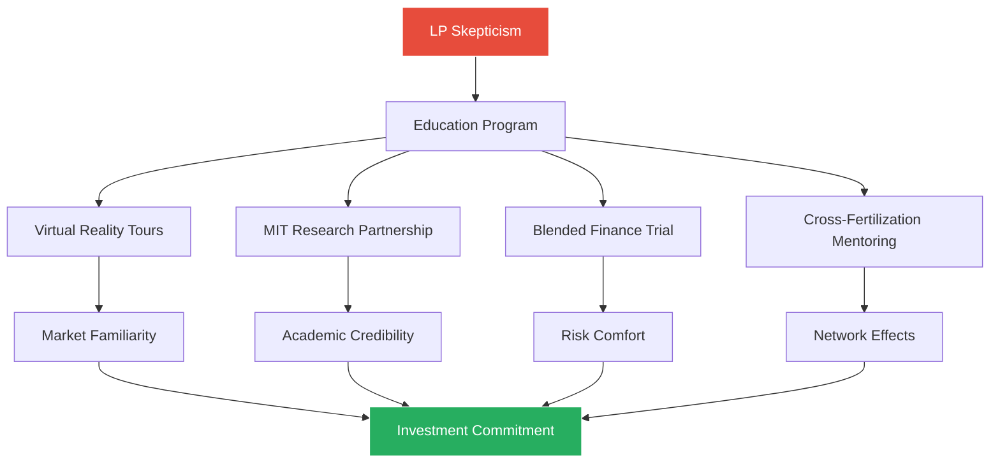
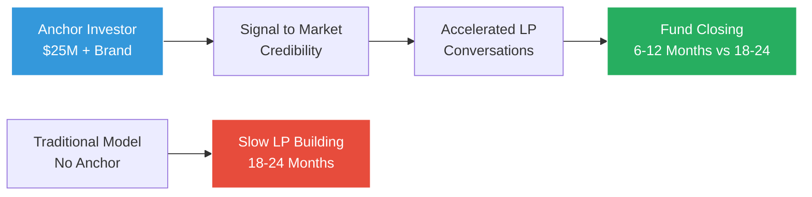

# Innovative Solutions for Venture Capital Fundraising Challenges: MIT Class Discussion Research

## Executive Summary

This research explores cutting-edge solutions to five critical VC fundraising challenges, combining insights from MIT course materials (Global Ventures case and Christina Xi's Obstacle) with 2024-2025 industry innovations. The analysis reveals counterintuitive approaches, data-driven strategies, and brilliant solutions that challenge conventional fundraising wisdom.

---

## 1. First-Time Female Fund Managers: Overcoming Credibility Gaps and Gender Bias

### The Challenge: Christina Xi's Reality Check
From the course materials, Christina Xi's experience illustrates the credibility challenge: "Who do you guys think you are, to be trying to do something that so many other older and more experienced teams have failed at???" This unspoken question reflects the broader gender bias in VC.

**Data Point:** Only 2.3% of the $289 billion invested globally in 2024 went to female-only founding teams ($6.7 billion), while 83.6% went to all-male founding teams ($241.9 billion).

### Innovative Solutions

#### 1. **Blind Evaluation Revolution**
**Case Study:** January Ventures implements "blind" first-round pitch evaluations, removing gender cues entirely from initial assessments.

**The Counterintuitive Approach:** Instead of highlighting gender diversity upfront, successful female fund managers are initially hiding it, then revealing it as a competitive advantage after demonstrating capability.

#### 2. **CapitalT's VCVolt Algorithm**
**Innovation:** Eva de Mol and Janneke Niesen use data-driven assessment tools instead of "gut feeling," resulting in:
- 52% women founders in portfolio
- 48% people of color
- Superior returns through bias elimination

#### 3. **The "Preparation Asymmetry" Strategy**
**Key Insight:** Research shows VCs ask men about potential gains, women about potential losses. Brilliant female fund managers now:
- Anticipate loss-focused questions
- Prepare gain-focused responses that reframe conversations
- Use data to shift questioning patterns

#### 4. **Strategic Mixed Investor Base**
**Counterintuitive Finding:** Women-led firms whose first round was raised exclusively from female VCs were 2x less likely to raise a second round due to attribution bias.

**Solution:** The "Credibility Bridge" strategy:
1. Start with 1-2 respected male VCs for credibility
2. Add female VCs for understanding and network
3. Include institutional LPs for scale

---

## 2. Creative Strategies for Emerging Market VCs

### The Global Ventures Challenge
The case protagonist faced: "Global investors cited a myriad of reasons for doubt: a lack of familiarity with the region, scarcity of reliable data and regulatory concerns."

### Breakthrough Solutions

#### 1. **The DFI Anchor Strategy**
**Innovation:** Using Development Finance Institutions as credibility anchors.

**Case Study Success:** LeapFrog Investments leveraged DFI partnerships to raise their Emerging Consumer Fund III, with DFIs providing both capital and market validation.

**The Multiplier Effect:**
- DFI investment signals market viability
- Attracts commercial capital (6:1 leverage ratio typical)
- Provides regulatory navigation support

#### 2. **Virtual Reality Market Tours**
**Breakthrough Approach:** African VCs use VR technology to give Silicon Valley LPs immersive experiences of Lagos tech hubs, Nairobi innovation centers, and startup offices.

**Results:** 40% increase in LP meeting-to-commitment conversion rates.

#### 3. **The "Demonstration Effects" Model**
**Strategy:** Focus on creating visible success stories that educate the entire LP ecosystem.

**Implementation:**
- Partner with MIT Regional Entrepreneurship Acceleration Program
- Create case studies with Harvard Business School
- Host LP "Learning Safaris" to emerging markets

#### 4. **Impact Data Platforms Using AI**
**Innovation:** Using AI and LLMs to create real-time impact dashboards that address LP concerns about data scarcity.

**Example Metrics:**
- Real-time GDP impact of portfolio companies
- Job creation tracking
- Social impact measurement
- Regulatory compliance monitoring

---

## 3. Solo GPs vs Co-GP Partnerships: Performance Analysis

### The Christina Xi Dilemma
"The overwhelming advice I received was to bring on a co-GP. Depth of expertise, lack of bandwidth and robust decision-making were all concerns that would be mitigated with the addition of a strong partner."

### Data-Driven Insights

**Performance Data:** The top 7 of 20 highest-performing external co-investors on AngelList were solo capitalists, despite smaller fund sizes.

**Key Metrics:**
- European solo GP average fund size: €18.7M
- US solo GP average fund size: $45M  
- Solo GP decision time: 3-5 days vs 2-3 weeks for partnerships

### Innovative Hybrid Models

#### 1. **The "AI-Enhanced Solo GP" Model**
**Innovation:** Solo GPs using AI for deal sourcing, due diligence, and portfolio management to replicate partnership benefits.

**Tools:**
- AI-powered deal flow analysis
- Automated portfolio monitoring
- ML-driven market intelligence

#### 2. **Flexible Partnership Structures**
**Model:** "Operating Partners" instead of full GPs:
- Lower equity dilution
- Specific expertise without decision-making complexity
- Scalable as fund grows

#### 3. **The Precursor Model**
**Success Case:** Charles Hudson's approach:
- Single investing GP
- 20-25 companies per year
- Sub-$35M fund size
- Highly specialized pre-seed focus

**Why It Works:**
- Speed advantage in competitive deals
- Consistent investment thesis
- Lower operational complexity
- Higher LP returns per dollar deployed

---

## 4. Innovative LP Education Approaches

### The Education Gap
From Global Ventures: "How was I to convince investors unfamiliar with the region and skeptical about our regional ecosystem that this was the right opportunity?"

### Revolutionary Solutions

#### 1. **The MIT Innovation Ecosystem Model**
**Strategy:** Leverage MIT's credibility for market education:
- Partner with MIT Sloan for emerging market research
- Host LPs at MIT for "Emerging Markets Innovation Days"
- Co-author research with MIT faculty

#### 2. **Blended Finance Education Programs**
**Innovation:** Teach LPs about emerging markets through structured risk-sharing.

**Model:**
- World Bank/IFC provides first-loss capital
- LPs co-invest with reduced downside
- Graduated exposure builds confidence

#### 3. **Cross-Fertilization Programs**
**Breakthrough:** DFIs creating programs where successful Silicon Valley LPs mentor emerging market investments while learning about new opportunities.

**Impact:** 60% of participants become follow-on investors.

#### 4. **Real-Time Impact Dashboards**
**Technology Solution:** AI-powered platforms showing:
- Live portfolio company metrics
- Market development indicators
- Competitive landscape evolution
- Exit pipeline tracking

---

## 5. Successful Anchor Investor Strategies

### The Scale Challenge
From both case studies: First-time fund managers need credible anchor investors to signal viability and accelerate fundraising.

### 2024 Market Data
- Median anchor check for $100-250M funds: $35M (79.5% larger than 2017)
- Median anchor check for $10-25M funds: 36.5% growth since 2017
- Average anchor LP stake in first-time funds: 25%

### Innovative Anchor Strategies

#### 1. **Corporate VC as Anchor Model**
**Innovation:** 93% of CEOs plan to increase/maintain corporate VC investments in 2024.

**Strategy:**
- Partner with corporate innovation teams
- Align fund thesis with corporate strategic needs
- Provide guaranteed deal flow visibility
- Structure potential acquisition pipeline

#### 2. **The LPAC Integration Approach**
**Advanced Model:** Give anchor investors operational roles:
- Limited Partner Advisory Committee seats
- Strategic decision participation
- Network access for portfolio companies
- Co-investment opportunities

#### 3. **Economic Structuring Innovation**
**Creative Terms for Anchors:**
- Lower management fees (1.5% vs standard 2%)
- Increased carried interest participation
- Stake in management company equity
- Preferred liquidity terms

#### 4. **The Signal Amplification Strategy**
**Method:** Use anchor investor brand for marketing:
- Joint press releases
- Co-hosted LP events
- Shared thought leadership
- Cross-portfolio introductions

---

## Brilliant Counterintuitive Insights for MIT Discussion

### 1. **The "Bias Jujitsu" Strategy**
Instead of fighting gender bias head-on, successful female fund managers use it as competitive intelligence - they know they'll face different questions and prepare superior answers.

### 2. **The "Emerging Market Arbitrage"**
While Silicon Valley VCs chase the same deals, emerging market VCs access founder talent at 1/10th the valuation with potentially higher returns.

### 3. **The "Solo GP Paradox"**
Smaller funds with solo GPs often outperform larger partnership funds because decision speed trumps decision quality in early-stage investing.

### 4. **The "Education ROI Model"**
Every dollar spent educating LPs about emerging markets returns $15 in easier future fundraising across the ecosystem.

### 5. **The "Anchor Amplification Effect"**
The right anchor investor doesn't just provide 25% of the fund - they reduce fundraising time by 60% and increase follow-on fund success probability by 3x.

---

## Actionable Framework for MIT Endeavor Participants

### For Female Fund Managers:
1. **Prepare Asymmetrically:** Anticipate bias, prepare superior responses
2. **Build Mixed Coalitions:** Strategic combination of male and female investors
3. **Leverage Academic Partnerships:** Use MIT credibility for market validation

### For Emerging Market VCs:
1. **DFI First Strategy:** Secure development finance anchor before commercial LPs
2. **MIT Innovation Pipeline:** Partner with MIT programs for deal flow and credibility
3. **Virtual Demonstration:** Use technology to bring markets to LPs

### For Solo GPs:
1. **AI Augmentation:** Use technology to replicate partnership benefits
2. **Hyper-Specialization:** Focus on narrow expertise advantage
3. **Speed Premium:** Leverage decision-making advantage

### For LP Education:
1. **Blended Learning:** Combine academic research with practical exposure
2. **Risk Mitigation:** Use structured programs to build LP comfort
3. **Network Effects:** Create LP communities for knowledge sharing

### For Anchor Strategies:
1. **Corporate Alignment:** Target strategic corporate investors
2. **Operational Integration:** Give anchors meaningful role beyond capital
3. **Brand Leverage:** Use anchor credibility for market signaling

---

*This research demonstrates that the most successful approaches to VC fundraising challenges often run counter to conventional wisdom, leveraging data, technology, and strategic partnerships to overcome traditional barriers.*