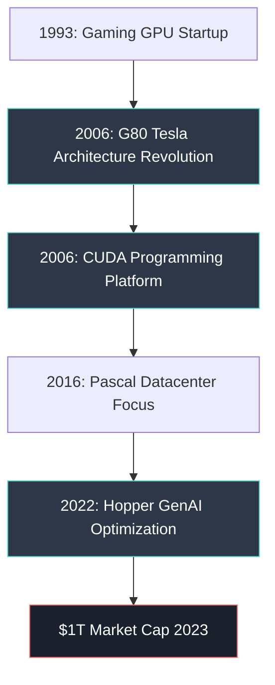
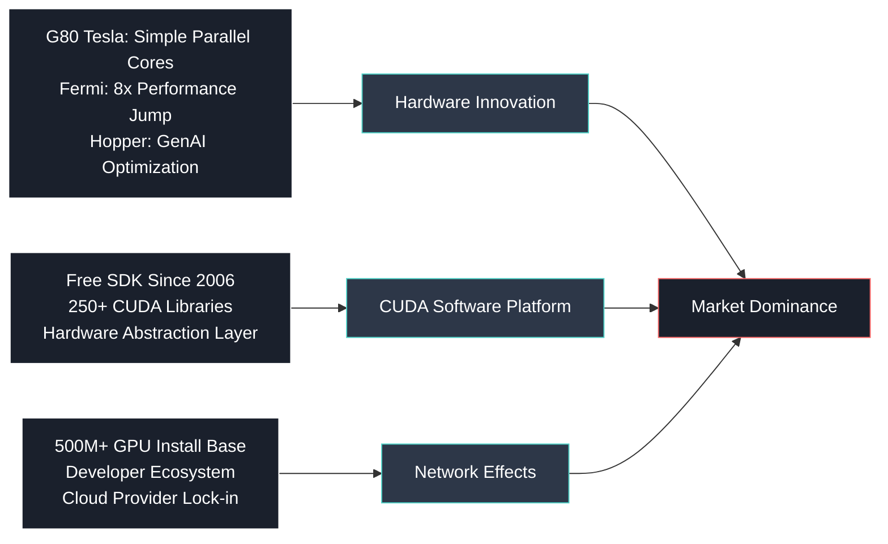
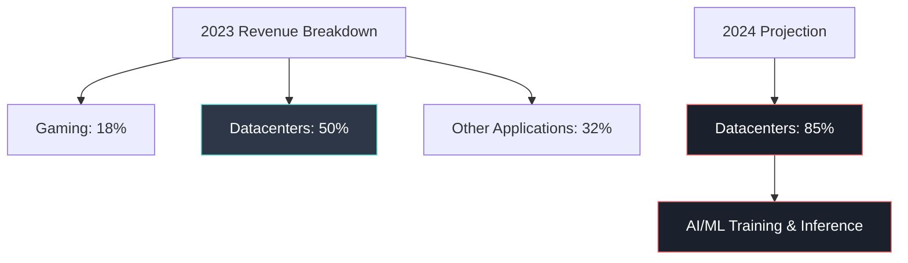
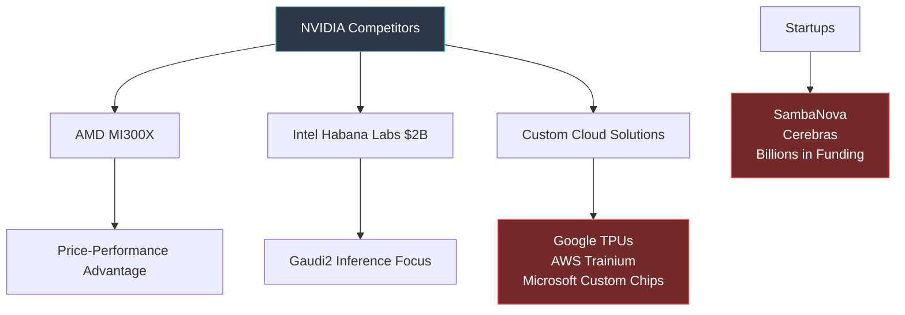
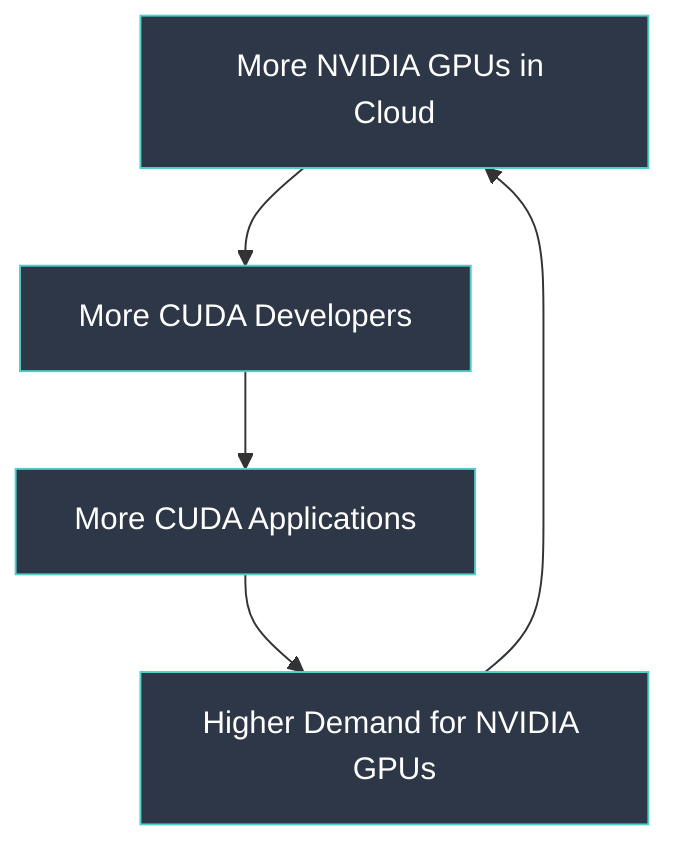
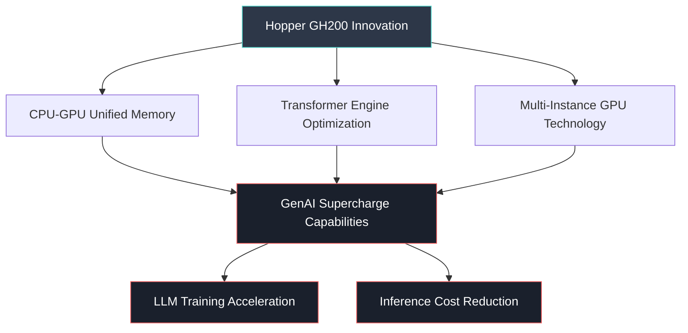
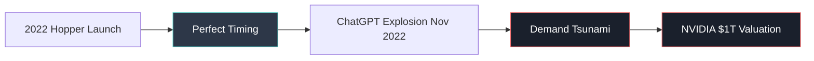

# NVIDIA at the Center of the GenAI Ecosystem: Executive Summary

## 🏆 Market Dominance
**NVIDIA** controls **80%** of the GPU market for generative AI, transforming from a **$1B gaming company (2002)** to **$1 trillion market cap leader**, with Q3 2023 sales of **$13.5B** and **$6.2B net profits** - doubling year-over-year.

## 🔧 Technological Advantages

### Three Competitive Moats

### 1. Architectural Innovation (2006 Breakthrough)
- **G80 Tesla**: Shifted from few complex cores to **thousands of simple parallel cores**
- **Performance**: 100-400x faster than Intel CPUs for parallel processing
- **Perfect Fit**: GPU architecture ideally suited for neural network matrix multiplication

### 2. CUDA Platform Strategy
- **Free SDK**: Eliminated developer barriers since 2006
- **Hardware Abstraction**: Code runs across different GPU generations
- **Ecosystem Lock-in**: CUDA only runs on NVIDIA hardware
- **Market Parallel**: Similar to Intel x86 + Microsoft Windows strategy

## 📊 Financial Performance

### Revenue Growth Trajectory

### Market Economics
- **H100 Processors**: $40,000 each, essential for datacenter AI
- **Supply Constraint**: Demand exceeding supply → premium pricing
- **China Exposure**: 20-25% of datacenter sales at risk from export restrictions

## ⚔️ Competitive Landscape

### Hardware Competition

### Software Threats
- **OpenCL**: Open source alternative (C-based)
- **OpenAI Triton**: Python-based, PyTorch 2.0 compatible  
- **Open Source Movement**: AMD/Intel embracing open source to compete
- **Future Risk**: Non-CUDA alternatives gaining developer mindshare

## 🔮 Strategic Position Analysis

### Flywheel Effect

### Competitive Advantages
1. **First-Mover**: 17-year head start in GPU computing (2006-2023)
2. **Developer Ecosystem**: 500M+ GPU installed base, thousands of applications
3. **Software Moat**: CUDA proprietary but essential for AI development
4. **R&D Investment**: Continuous architectural improvements (G80→Fermi→Pascal→Hopper)

## ⚠️ Strategic Risks

### Potential Disruption Vectors
1. **Software Commoditization**: Open source alternatives gaining traction
2. **Cloud Provider Integration**: Custom chips reducing dependency
3. **Geopolitical**: China export restrictions limiting growth
4. **Market Maturation**: Shift to smaller, focused LLMs requiring less compute

### Defensive Responses
- **Language Support**: Adding Python (PyCuda) beyond C/C++
- **Industry Partnerships**: Deep integration with cloud providers
- **Continuous Innovation**: Hopper architecture optimized for GenAI workloads

## 🚀 **2022 Hopper Revolution: The GenAI Game-Changer**

### **GH200 "Grace Hopper" Superchip Architecture**

### **Technical Breakthrough Features**
- **Named After**: Grace Murray Hopper, programming pioneer and Admiral
- **Hybrid Architecture**: Combines GPU compute cores with ARM-based CPU capabilities
- **Memory Revolution**: Up to **144GB** unified high-bandwidth memory (5x more than H100)
- **Transformer Optimization**: Built-in **Transformer Engine** specifically for attention mechanisms in LLMs
- **Multi-Tenancy**: Single chip can run multiple AI workloads simultaneously

### **GenAI Performance Impact**
- **Training Speed**: **4x faster** LLM training compared to previous generation
- **Inference Efficiency**: **10x better** cost-performance for ChatGPT-style applications
- **Memory Bandwidth**: **3TB/s** enables handling of massive language models
- **Energy Efficiency**: **2.5x** better performance-per-watt for AI workloads

### **Strategic Market Positioning**

**Market Timing Genius**: Hopper launched just months before ChatGPT triggered the GenAI boom, positioning NVIDIA as the **only supplier** with hardware optimized for the new workload demands.

## 📈 Investment Outlook

### Bull Case
- **Platform Dominance**: Network effects protecting market position
- **Growth Market**: GenAI applications expanding beyond current use cases
- **Pricing Power**: Supply constraints supporting premium pricing

### Bear Case  
- **Competition**: AMD, Intel, cloud providers developing alternatives
- **Commoditization**: Open source software reducing switching costs
- **Regulatory**: Export restrictions limiting global market access

## 🎯 Strategic Conclusion

**NVIDIA's Position**: **Dominant but not invincible** - 17-year technological lead and network effects provide strong competitive moats, but alternative solutions are actively being developed.

**Key Success Factor**: Maintaining innovation pace while defending software ecosystem against open source alternatives.

---
*Executive Summary prepared for MIT Endeavor Program | January 2025 Analysis*  
*Focus: NVIDIA's competitive position evolution (2006-2025) and hardware ecosystem dynamics*