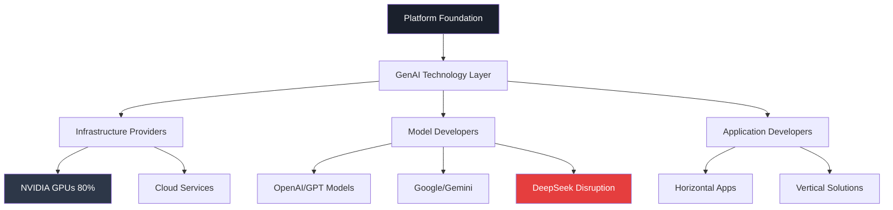
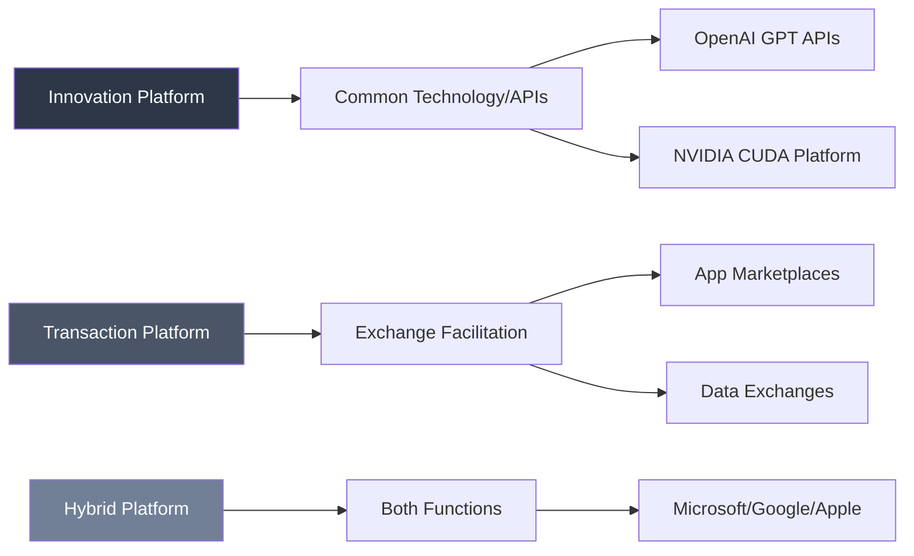
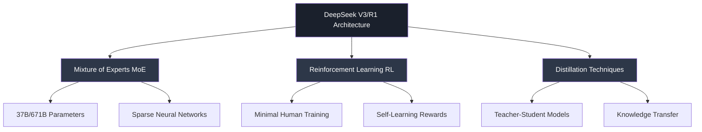

# GENERATIVE AI AS AN INNOVATION PLATFORM
## Executive Summary - MIT Endeavor Program Session 2

**Date:** Day 1, Session 2  
**Topic:** Generative AI Ecosystem, Platform Economics, and Market Disruption  
**Background:** Dark theme optimized for executive viewing

---

## I. EXECUTIVE SUMMARY

The emergence of Generative AI represents a **paradigm shift** in platform economics, with profound implications for competitive advantage and market structure. Our analysis reveals that while GenAI exhibits platform characteristics, it functions as a **foundational enabling technology** requiring platform layers to achieve network effects.

**Key Findings:**
- GenAI creates new platform opportunities but requires significant infrastructure investment ($100M-$1B+ for LLM training)
- **NVIDIA dominates** 80% of the GPU market essential for GenAI operations, creating a critical bottleneck
- **DeepSeek's breakthrough** demonstrates cost-efficient development ($5.6M vs $100M+), potentially disrupting the ecosystem economics
- Platform network effects drive exponential value creation through positive feedback loops

---

## II. PLATFORM ECONOMICS FUNDAMENTALS

### Network Effects and Value Creation

**Definition:** Platforms serve as foundational technology enabling interaction and innovation between multiple market sides.

**Critical Success Factors:**
1. **Multi-sided Markets:** Connect 2+ critical actors (users, developers, complementors)
2. **Network Effects:** Value increases exponentially with user adoption (Metcalf's Law: n users = n(n-1)/2 connections)
3. **Chicken-and-Egg Solutions:** Overcome initial adoption barriers through standalone value or subsidization
4. **Self-Reinforcing Loops:** More users → More applications → More value → More users

### Platform Types in GenAI Context

---

## III. THE NVIDIA DOMINANCE PARADIGM

### Market Position (2024)
- **80% market share** in GenAI-optimized GPUs
- **$1+ trillion market cap** (vs Intel $154B, AMD $159B)
- **H100 processors** at $40,000+ each creating supply constraints

### Competitive Advantages
1. **Architectural Innovation:** G80 Tesla series (2006) shifted from complex specialized cores to massive parallel simple cores
2. **CUDA Software Ecosystem:** Proprietary development platform with 250+ libraries
3. **Network Effects:** Hardware-software lock-in creating developer stickiness
4. **First-Mover Advantage:** Early investment in AI/ML optimization (2011-2017)

### Strategic Vulnerabilities
- **Export restrictions** limiting China sales (20-25% of datacenter revenue)
- **Open-source alternatives** (OpenCL, OpenAI's Triton, PyTorch)
- **Cloud provider competition** (Google TPUs, AWS Trainium, Microsoft custom chips)
- **AMD/Intel catching up** with price-performance advantages

---

## IV. THE DEEPSEEK DISRUPTION

### Breakthrough Economics
**Traditional Model:** $100M-$1B+ training costs  
**DeepSeek Achievement:** $5.6M for comparable performance

### Technical Innovation Strategy

### Market Impact
- **API pricing disruption:** DeepSeek $0.07-$2.19 vs OpenAI $15-$60 per million tokens
- **Cost commoditization concern** for incumbent players
- **Jevons Paradox potential:** Lower costs may drive exponential demand growth
- **Open-source acceleration:** Detailed technical reports democratizing knowledge

---

## V. STRATEGIC IMPLICATIONS

### For Incumbents (OpenAI, Google, Microsoft)
**Immediate Threats:**
- Margin compression from pricing pressure
- Need for efficiency optimization
- Potential talent migration to cost-efficient competitors

**Strategic Response Options:**
1. **Double down on R&D** for next-generation capabilities
2. **Vertical integration** to control costs
3. **Platform ecosystem expansion** to increase switching costs

### For New Entrants
**Opportunity Windows:**
- **Cost-efficient training methods** following DeepSeek model
- **Specialized vertical applications** avoiding direct competition
- **Hardware alternatives** to NVIDIA dependency

**Entry Barriers:**
- **Talent scarcity** in AI/ML optimization
- **Computational infrastructure** requirements
- **Regulatory complexity** especially for cross-border operations

### For Enterprise Users
**Strategic Considerations:**
1. **Multi-vendor strategy** to avoid platform lock-in
2. **Cost optimization** through efficient model selection
3. **Data sovereignty** concerns with Chinese/foreign providers
4. **Integration complexity** managing multiple platforms

---

## VI. TIMELINE-ACCURATE MARKET EVOLUTION

### Historical Context (2006-2024)
- **2006:** NVIDIA G80 Tesla architecture breakthrough
- **2017:** Google Transformer research publication
- **2020:** OpenAI GPT-3 "platformization" 
- **2022:** ChatGPT mass market adoption
- **2024:** NVIDIA $1T+ valuation peak
- **2025:** DeepSeek disruption emergence

### Future Trajectory (2025-2027)
**Likely Scenarios:**
1. **Efficiency Wars:** Competition shifts from scale to optimization
2. **Hardware Diversification:** Reduced NVIDIA dependency
3. **Regulatory Intervention:** Government controls on AI development
4. **Platform Consolidation:** Winner-take-most dynamics emerge

---

## VII. RECOMMENDATIONS

### For Platform Strategy
1. **Build ecosystem defensibility** through developer tools and network effects
2. **Invest in efficiency R&D** to compete on cost-performance
3. **Develop hardware alternatives** to reduce vendor dependency
4. **Create switching costs** through data/integration lock-in

### For Investment Allocation
- **High Priority:** Infrastructure efficiency and optimization
- **Medium Priority:** Vertical application development  
- **Low Priority:** Competing directly on foundational model development

### Risk Mitigation
- **Geopolitical:** Diversify technology stack across regions
- **Technical:** Maintain multiple vendor relationships
- **Economic:** Prepare for margin compression and commoditization

---

**Generated with Claude Code - MIT Endeavor Program Analysis**  
**Timeline Reference:** Based on 2006-2025 market evolution data