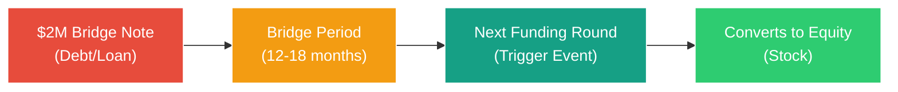
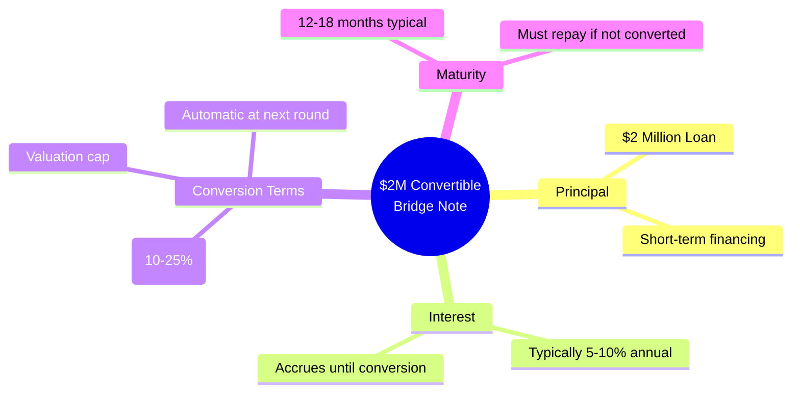
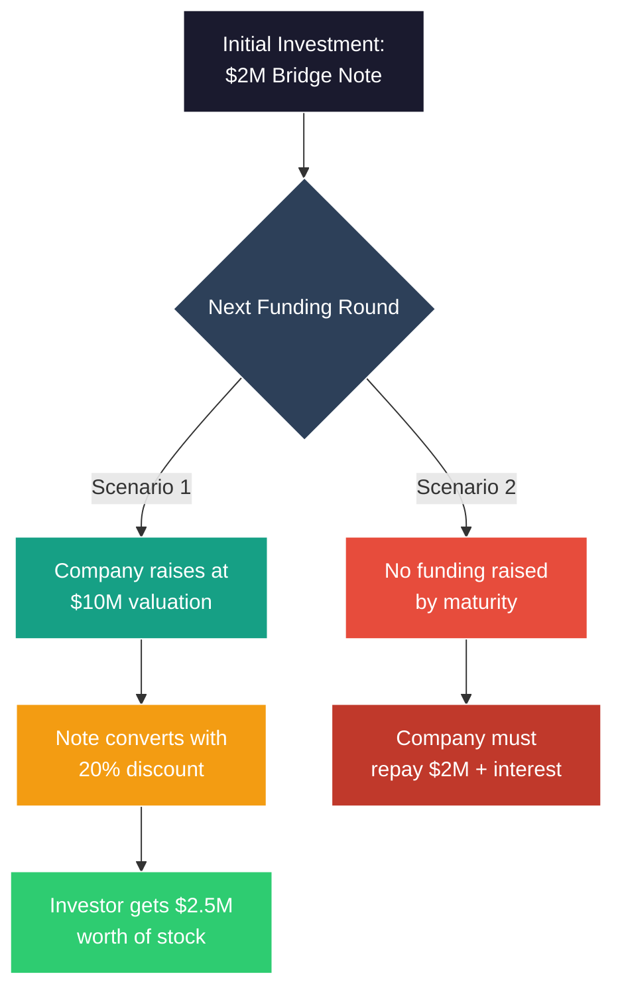

# Zipcar Case Study (2003-2004): Understanding the $2M Convertible Bridge Note

## 📊 What is a Convertible Bridge Note?

A **convertible bridge note** is a short-term loan that "bridges" a company to its next funding round and converts into equity (stock) at that time.

## 🔑 Key Components of Zipcar's $2M Note

## 💡 Why Use a Bridge Note?

### For Zipcar:
1. **Quick Capital**: Faster than negotiating full equity round
2. **Delay Valuation**: Avoid setting company value too early
3. **Lower Legal Costs**: Simpler documentation than equity round
4. **Bridge to Growth**: Fund operations until next major round

### For Investors:
1. **Discount on Future Equity**: Convert at 10-25% discount
2. **Interest Income**: Earn interest until conversion
3. **Priority Position**: Senior to equity in liquidation
4. **Upside Potential**: Participate in future growth

## 📈 How Conversion Works

## ⚖️ Risk vs. Reward

| **Risks** | **Rewards** |
|-----------|-------------|
| Must repay if no conversion | Discount on future equity |
| Creates debt obligation | Delays difficult valuation |
| Pressure to raise next round | Quick access to capital |
| Dilution at conversion | Lower transaction costs |

## 🎯 Historical Context: Early 2000s Car Sharing Pioneer

**Zipcar Timeline Context**:
- **Founded**: 2000 by Antje Danielson and Robin Chase
- **Bridge Note Period**: ~2003-2004 (early growth phase)
- **Market Environment**: Pre-smartphone era, early internet adoption
- **Technology**: Basic web platform, RFID car access cards

The $2M convertible bridge note served to:
1. **Fund immediate operations** during early market validation phase
2. **Bridge to institutional funding** before widespread tech venture interest
3. **Avoid undervaluing** the pioneer car-sharing concept
4. **Maintain momentum** in an unproven market category

**Historical Significance**: This case represents early-stage funding challenges before the tech boom, when car-sharing was an untested business model requiring significant capital for fleet acquisition and technology infrastructure.

## 📝 Key Takeaway

A convertible bridge note is essentially a **temporary loan that becomes ownership** - it provides immediate cash while postponing the complex valuation discussion until the company has more traction and data to support a fair valuation.

---

*Historical Note: This early 2000s "bridge" financing case demonstrates how startups accessed critical capital before the modern venture ecosystem, when unproven business models like car-sharing faced significant funding challenges due to high capital requirements and uncertain market acceptance.*