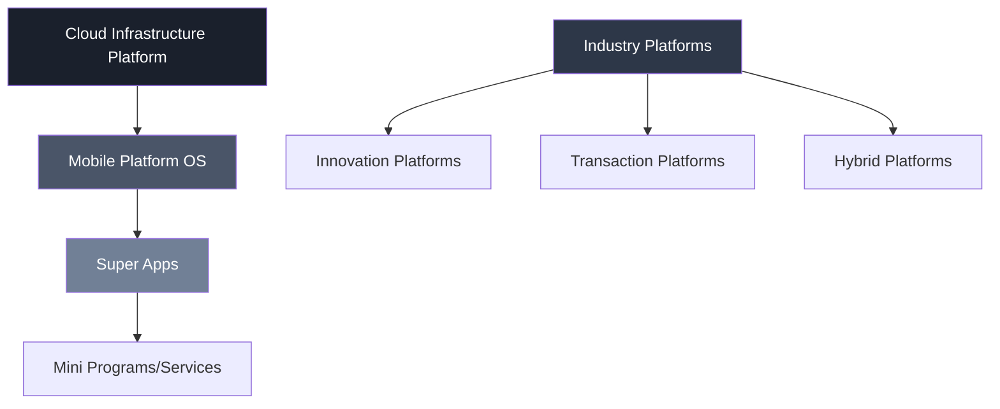
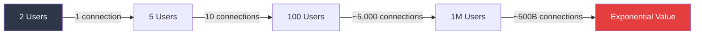
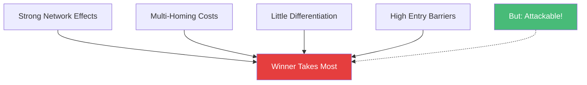
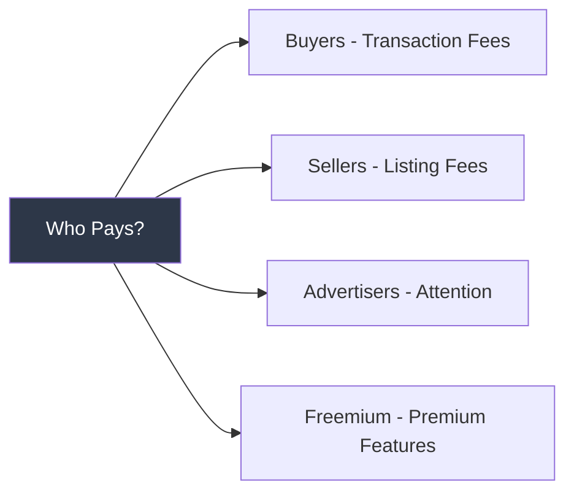
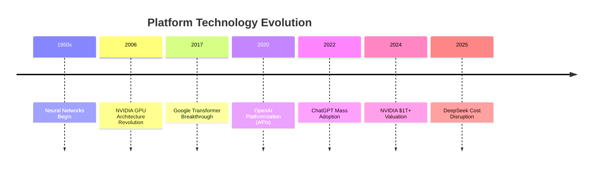
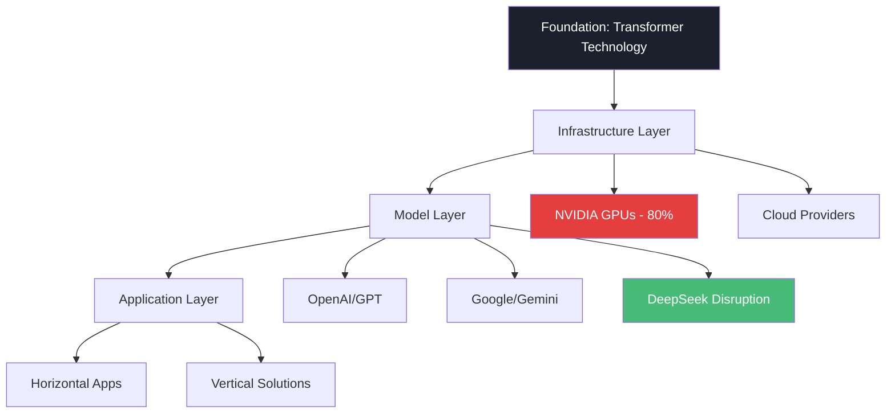

# Platform Economics & GenAI Revolution
## MIT Endeavor Program - Day 1, Session 2

**Core Learning:** How platforms create exponential value through network effects and why GenAI represents both an opportunity and disruption to traditional platform economics

---

## 🎯 THE BIG PICTURE: Platforms Are Eating The World

### Platform Hierarchy & Layering

**Key Insight:** Platforms stack on top of each other - mobile platforms run on cloud, super-apps run on mobile. Each layer captures value while enabling the next.

### Why Platforms Dominate
- **50% of unicorns** are platforms or trying to become platforms
- **Reusable components** → Create product families easily
- **Value shifts** from device to ecosystem (Remember BlackBerry & Nokia's fate)
- **Network effects** create exponential, not linear growth

---

## 📈 NETWORK EFFECTS: The Platform Superpower

### Metcalf's Law in Action

**Mathematical Reality:**
- Connections = n(n-1)/2
- Value grows geometrically while costs grow linearly
- **BUT:** Decline is also non-linear (platform death spirals)

### The Positive Feedback Loop
1. More users join platform
2. Platform becomes more valuable
3. More developers create apps
4. Apps attract more users
5. Return to step 1 → **EXPONENTIAL GROWTH**

---

## 🥚 SOLVING THE CHICKEN & EGG PROBLEM

### Three Proven Strategies

#### 1. **Create Standalone Value First**
- Build something useful WITHOUT network effects
- Solve a common industry problem
- Example: Amazon started by aggregating suppliers before buyers came

#### 2. **Subsidize One or Both Sides**
- Free usage for early adopters
- Technical assistance and support
- Build/buy key complements and bundle
- Example: Gaming consoles sold at loss, profit from games

#### 3. **Simultaneous Launch (Zig-Zag)**
- Pay multiple sides to connect
- Form partnerships instead of waiting for organic growth
- Example: Credit cards launching with both merchants and consumers

**Anti-Pattern Warning:** If you don't have a chicken-egg problem, you don't have a platform!

---

## 🏆 WINNER-TAKE-MOST DYNAMICS

### Why Platforms Tend Toward Monopoly

**Conditions for Dominance:**
1. **Strong network effects** - Value increases with scale
2. **Multi-homing costly** - Expensive to use multiple platforms
3. **Little differentiation** - Competitors offer similar value
4. **High barriers to entry** - Infrastructure, regulations, scale

**BUT:** Dominant platforms CAN be attacked (MySpace → Facebook, Yahoo → Google)

---

## 🚀 BUILDING A PLATFORM BUSINESS

### The Four-Step Framework

#### Step 1: Choose Your Market Sides
- Who are your critical actors?
- What value do they exchange?
- Which side has more power?

#### Step 2: Solve Chicken & Egg
- Pick your trigger side (supply or demand)
- Create initial value proposition
- Subsidize strategically

#### Step 3: Design Business Model

**Reality Check:** No one wants to pay without network effects → Start free!

#### Step 4: Establish Ecosystem Rules
- Quality standards
- Pricing guidelines
- Dispute resolution
- Platform governance

---

## ⚠️ PLATFORMANIA: When Platform Dreams Die

### Common Failure Patterns

**"Platformizing Bad Business ≠ Good Business"**

Examples of platform failures:
- **Uber:** Subsidizing both drivers AND riders indefinitely
- When network effects don't materialize organically
- Platform stops when one side stops (not a true platform)

### Platform Business Advice
✅ **DO:**
- Target industry-wide problems (market failures = opportunities)
- Design compelling standalone value
- Choose innovation vs transaction based on actors
- Grow via network effects OR partnerships

❌ **DON'T:**
- Force platform model on linear business
- Subsidize forever waiting for network effects
- Ignore ecosystem governance
- Assume platform = automatic success

---

## 🤖 GENAI: The New Platform Battleground

### Historical Evolution

### The GenAI Platform Stack

### Key Platform Dynamics in GenAI

**NVIDIA's Bottleneck Control:**
- 80% GPU market share = platform gatekeeper
- CUDA ecosystem = 250+ proprietary libraries
- Hardware-software lock-in strategy
- $40,000+ per H100 processor

**DeepSeek's Disruption Model:**
- $5.6M training vs $100M+ industry standard
- API pricing: 95% cheaper than OpenAI
- Proves efficiency > scale in platform competition
- Open source acceleration democratizes access

---

## 💡 STRATEGIC TAKEAWAYS

### Platform Success Formula
1. **Network Effects** > Features
2. **Ecosystem** > Product
3. **Winner-Take-Most** but not forever
4. **Chicken-Egg** must be solved Day 1
5. **Platform ≠ Automatic Success**

### GenAI Platform Implications
- **Enabling technology** requiring platform layers
- **Infrastructure bottlenecks** create power positions
- **Cost disruption** (DeepSeek) challenges incumbents
- **Open vs Closed** ecosystem battle intensifying

### Critical Questions for Entrepreneurs
1. Is my business truly a platform or linear model in disguise?
2. Which side should I trigger first in my chicken-egg solution?
3. How can I create standalone value before network effects?
4. What's my strategy when platforms tend toward monopoly?
5. How do I compete when efficiency beats scale (DeepSeek lesson)?

---

## 📊 Platform Types Quick Reference

| Type | Value Creation | Examples | Success Factor |
|------|---------------|----------|----------------|
| **Innovation** | Common tech/APIs for 3rd parties | iOS, Android, CUDA | Developer ecosystem |
| **Transaction** | Connect buyers/sellers | Amazon, Uber, Airbnb | Liquidity & trust |
| **Hybrid** | Both innovation & transaction | Apple, Google, Microsoft | Seamless integration |

**Market Reality:** 80% are transaction platforms (easier to start, harder to defend)

---

## 🔮 Future Platform Trends

### What's Coming (2025-2027)
1. **Efficiency Wars:** Cost-per-output becomes key metric
2. **Hardware Diversification:** Breaking NVIDIA monopoly
3. **Platform Consolidation:** Winner-take-most accelerates
4. **Regulatory Backlash:** Government intervention likely

### Platform Innovation Opportunities
- **Vertical GenAI platforms** for specific industries
- **Cost-efficient training** infrastructure
- **Open source alternatives** to proprietary ecosystems
- **Platform orchestration** layers (platforms of platforms)

---

**Remember:** "Platforms don't like interoperability" - They want to be THE platform, not A platform. Design your strategy accordingly.

**Energy Reality Check:** AI training energy usage doubling every 6 months - sustainability will become a platform differentiator!

---

*MIT Endeavor Program - Platform Economics & GenAI Revolution*  
*Timeline Context: Analysis current as of 2025*