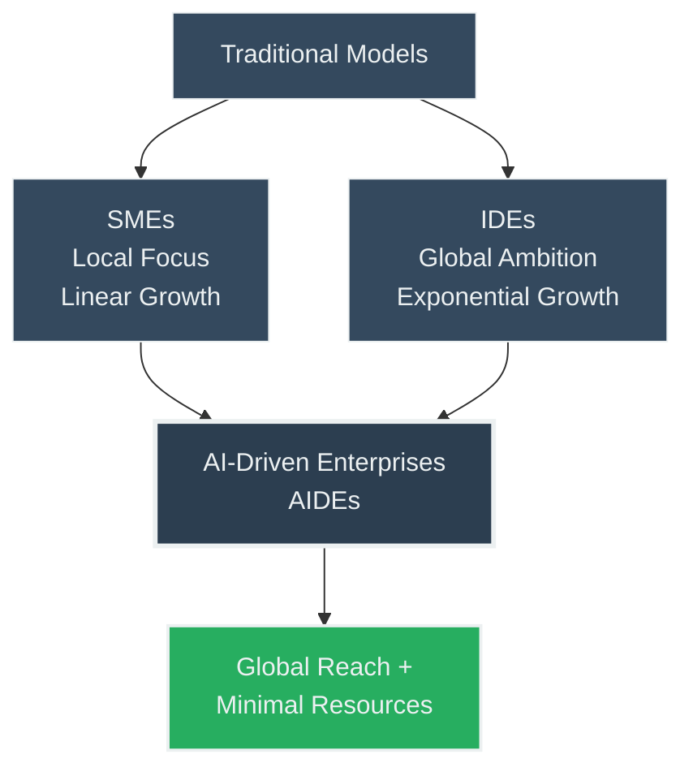
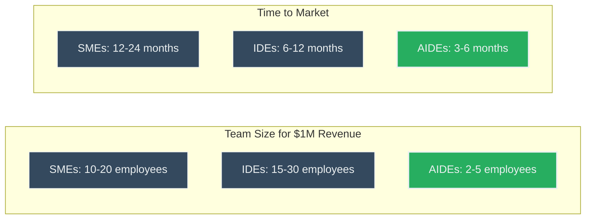
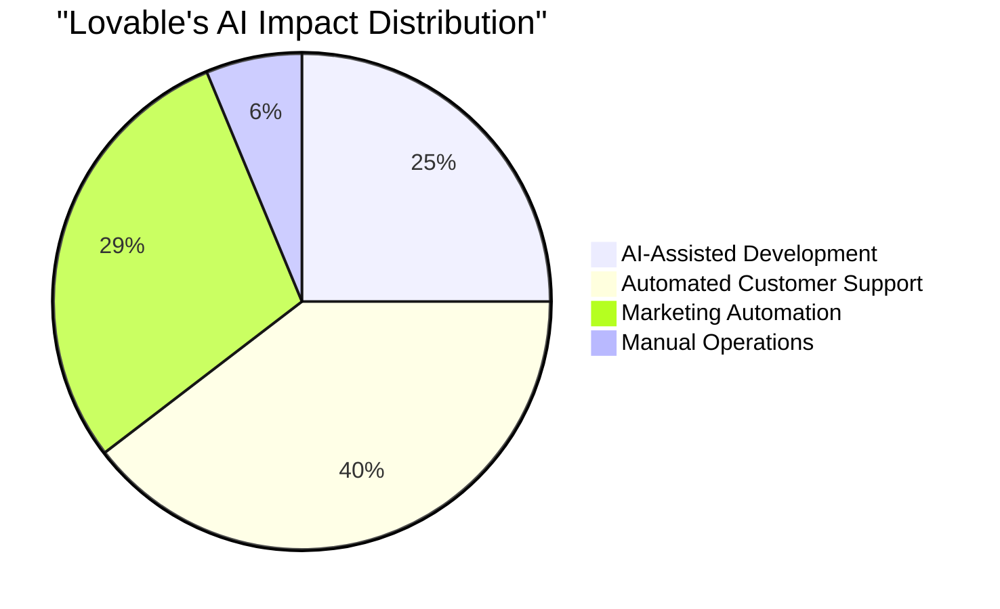
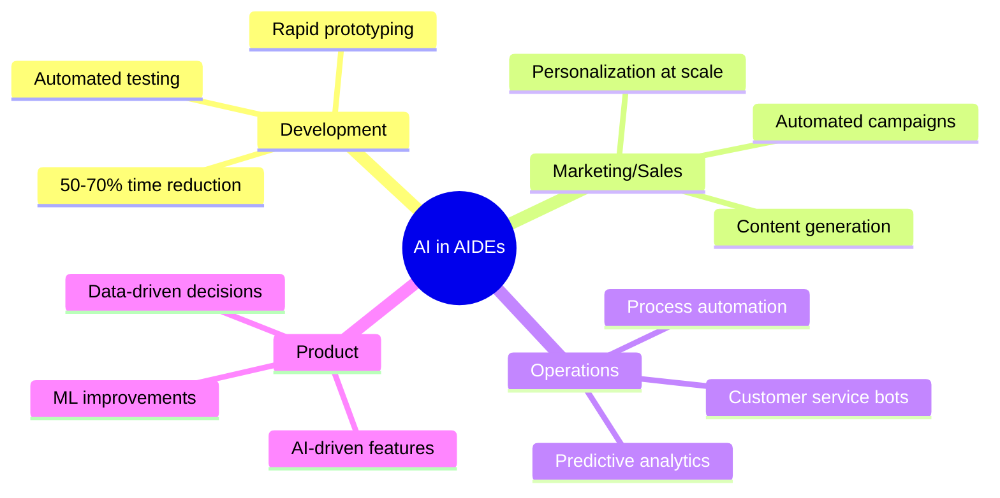
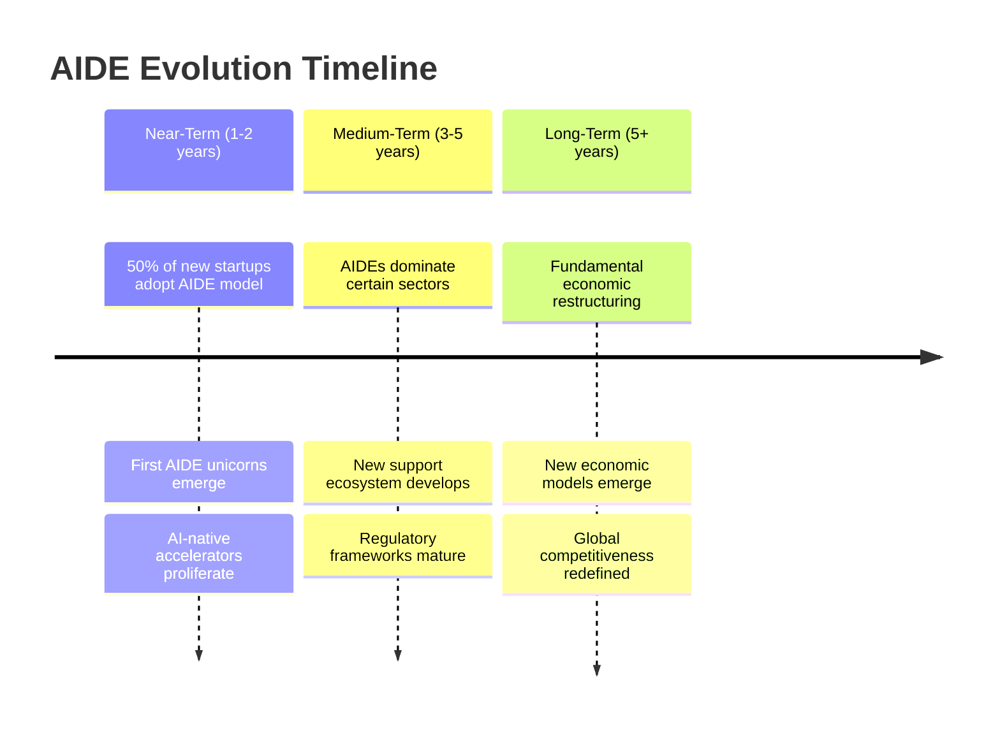
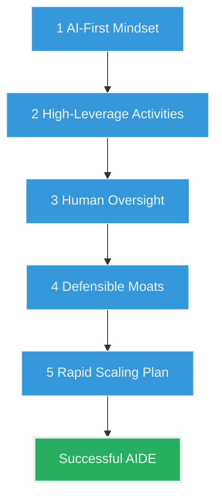

# AI-Driven Enterprises (AIDEs) - Executive Summary

## Overview
**Source:** Paul Cheek - AI-Driven Enterprises Article  
**Date:** May 21  
**Focus:** New entrepreneurship paradigm leveraging AI for unprecedented efficiency

## Core Concept

## Key Formula
### 🚀 **Fewer People + Less Time + Less Capital = High-Impact Innovation**

## Comparative Analysis

## Case Study: Lovable 📊

### Lovable's Achievements:
- **Team:** 3 founders only
- **Users:** 10,000+ in first year
- **Revenue:** $1M+ ARR
- **Global Reach:** 40+ countries
- **Support Automation:** 95%

## AI Leverage Points in AIDEs

## Timeline Predictions

## Stakeholder Implications

### 👨‍💼 **Entrepreneurs**
- Lower barriers to entry
- AI literacy essential
- Focus on orchestration over execution

### 💰 **Investors**
- Smaller initial investments
- Higher potential returns
- New evaluation metrics (revenue/employee)

### 🏛️ **Policymakers**
- Address job displacement
- Develop AI governance
- Update competition policies

## Best Practices for Building AIDEs

## Key Challenges

### ⚠️ **Technical**
- AI reliability
- Integration complexity
- Data quality

### 💼 **Business**
- Customer trust
- Market differentiation
- Talent acquisition

### 🌍 **Societal**
- Employment disruption
- Digital divide
- Ethical considerations

## Conclusion

**AIDEs represent a paradigm shift in entrepreneurship:**
- Small teams can now compete globally
- Traditional business models face disruption
- AI orchestration becomes core competency

> **The future belongs to those who can effectively orchestrate AI to create value at unprecedented scale and efficiency.**

---

*This summary captures the essence of how AI is fundamentally transforming the entrepreneurship landscape, enabling a new breed of ultra-efficient, globally-competitive enterprises.*