# AI Interdependency: Detailed Thinking Flow Charts

## Comprehensive Thinking Flows for All Challenges and Interventions

### 1. Integrating Experts and Algorithms - Complete Thinking Flow

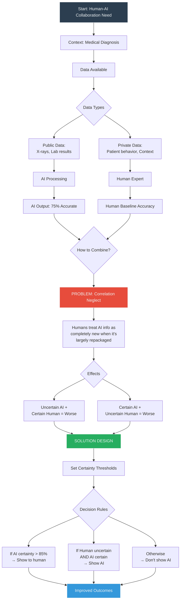

### 2. Algorithmic Monoculture - Complete Thinking Flow

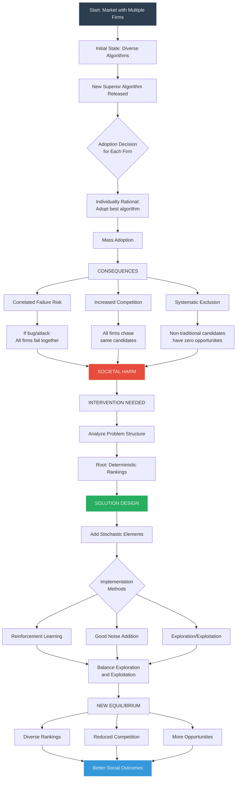

### 3. Anticompetitive Behavior - Complete Thinking Flow

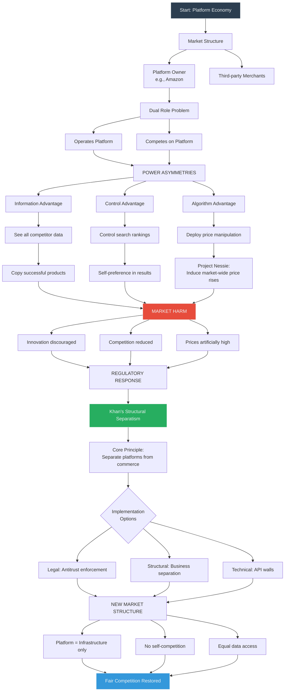

### 4. Algorithmic Misalignment - Complete Healthcare Thinking Flow

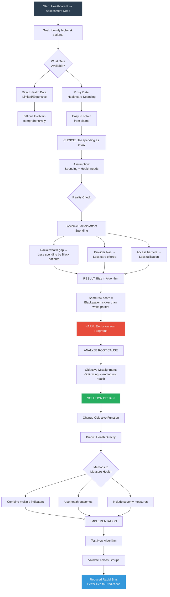

### 5. Effective Objective Functions - Complete Thinking Flow

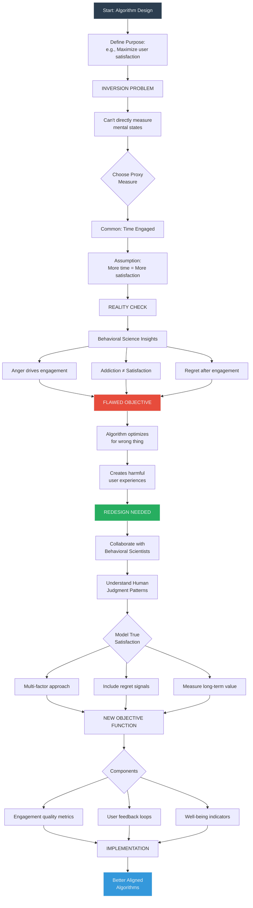

### 6. Model Selection Impact - Complete Thinking Flow

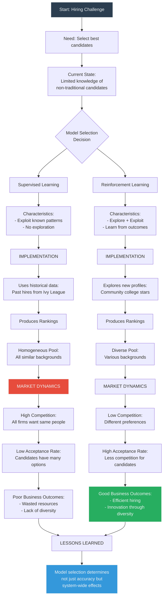

### 7. Multi-Dimensional Evaluation - Complete Thinking Flow

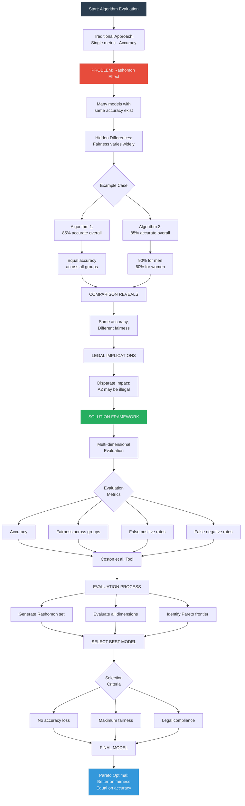

### 8. Out-of-Sample Evaluation - Complete Thinking Flow

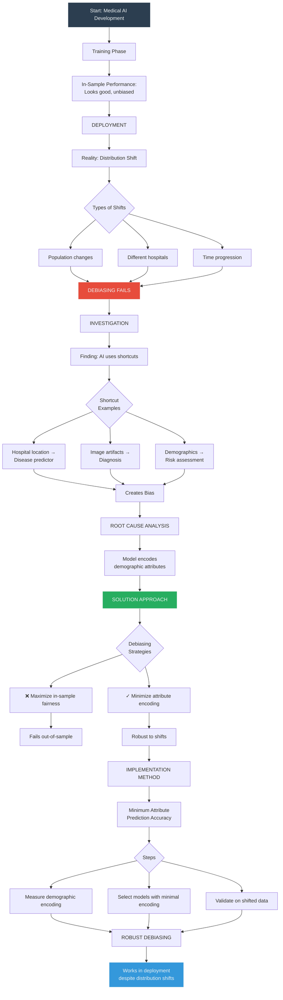

### 9. Current World State Bias - Complete Thinking Flow

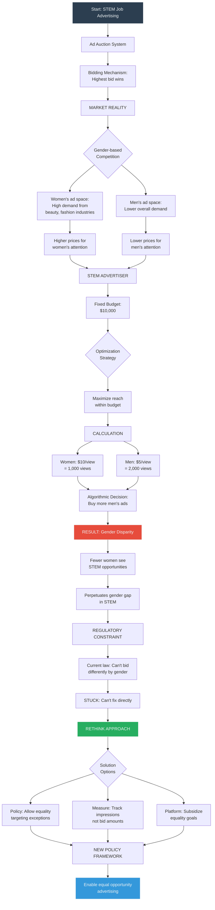

### 10. Data Selection Impact - Complete Thinking Flow

```mermaid
flowchart TD
    Start[Start: Training Data Decision] --> Context[Context: Systemic racism exists]
    
    Context --> Question{Include protected<br/>attributes?}
    
    Question --> Path1[Path 1: Exclude Race]
    Question --> Path2[Path 2: Include Race]
    
    Path1 --> P1Logic[Logic: Avoid discrimination<br/>by being "colorblind"]
    Path2 --> P2Logic[Logic: Account for<br/>systemic factors]
    
    P1Logic --> P1Data[Training without race data]
    P2Logic --> P2Data[Training with race data]
    
    P1Data --> P1Model[MODEL 1 BEHAVIOR]
    P2Data --> P2Model[MODEL 2 BEHAVIOR]
    
    P1Model --> P1Ex[Example: College admissions]
    P1Ex --> P1Eval[Evaluates extracurriculars equally]
    
    P2Model --> P2Ex[Example: College admissions]
    P2Ex --> P2Eval[Adjusts for income context]
    
    P1Eval --> P1Problem[PROBLEM: Ignores that<br/>low-income students<br/>work after school]
    
    P2Eval --> P2Adjust[ADJUSTMENT: Recognizes<br/>work experience as<br/>equivalent signal]
    
    P1Problem --> P1Result[Perpetuates inequality:<br/>Favors high-income students]
    
    P2Adjust --> P2Result[Promotes equity:<br/>Fair evaluation across groups]
    
    P1Result --> Compare[COMPARISON]
    P2Result --> Compare
    
    Compare --> Finding[Including race data<br/>can increase fairness]
    
    Finding --> Nuance[KEY NUANCE]
    
    Nuance --> Careful[Must be done carefully:<br/>- Clear objectives<br/>- Transparent process<br/>- Regular auditing]
    
    Careful --> Framework[DECISION FRAMEWORK]
    
    Framework --> F1[Assess systemic factors]
    Framework --> F2[Define fairness goals]
    Framework --> F3[Test both approaches]
    Framework --> F4[Monitor outcomes]
    
    F1 --> Best[SELECT BEST APPROACH]
    F2 --> Best
    F3 --> Best
    F4 --> Best
    
    Best --> Outcome[Context-dependent<br/>data selection]
    
    style Start fill:#2c3e50,stroke:#ecf0f1,color:#ecf0f1
    style P1Problem fill:#e74c3c,stroke:#ecf0f1,color:#ecf0f1
    style P2Adjust fill:#27ae60,stroke:#ecf0f1,color:#ecf0f1
    style Outcome fill:#3498db,stroke:#ecf0f1,color:#ecf0f1
```

### 11. Human Override Decisions - Complete Thinking Flow

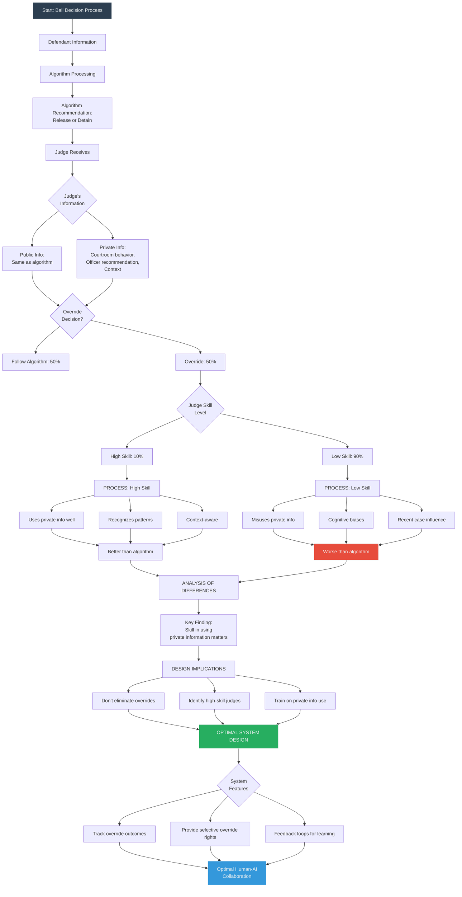

## Master Integration: How All Challenges Connect

```mermaid
graph TB
    subgraph "System Components"
        World[Current World State]
        Data[Data]
        Model[Model Selection]
        Obj[Objectives]
        Algo[Algorithm]
        Human[Human Decision Maker]
        Action[Actions]
    end
    
    subgraph "Challenges"
        C1[Correlation Neglect]
        C2[Monoculture]
        C3[Anticompetitive]
        C4[Misalignment]
        C5[Bad Objectives]
        C6[Poor Model Choice]
        C7[Single Metric Eval]
        C8[Distribution Shift]
        C9[World State Bias]
        C10[Data Selection]
        C11[Override Issues]
    end
    
    subgraph "Interventions"
        I1[Threshold Rules]
        I2[Stochastic Algorithms]
        I3[Structural Separation]
        I4[Change Objectives]
        I5[Behavioral Science]
        I6[RL Exploration]
        I7[Multi-dimensional Eval]
        I8[Minimize Encoding]
        I9[Policy Reform]
        I10[Include Context]
        I11[Selective Overrides]
    end
    
    World --> C9
    C9 --> I9
    
    Data --> C10
    C10 --> I10
    
    Model --> C6
    C6 --> I6
    
    Obj --> C4
    C4 --> I4
    
    Obj --> C5
    C5 --> I5
    
    Algo --> C2
    C2 --> I2
    
    Algo --> C7
    C7 --> I7
    
    Algo --> C8
    C8 --> I8
    
    Human --> C1
    C1 --> I1
    
    Human --> C11
    C11 --> I11
    
    Action --> C3
    C3 --> I3
    
    style World fill:#2c3e50,stroke:#ecf0f1,color:#ecf0f1
    style I1 fill:#27ae60,stroke:#ecf0f1,color:#ecf0f1
    style I2 fill:#27ae60,stroke:#ecf0f1,color:#ecf0f1
    style I3 fill:#27ae60,stroke:#ecf0f1,color:#ecf0f1
    style I4 fill:#27ae60,stroke:#ecf0f1,color:#ecf0f1
    style I5 fill:#27ae60,stroke:#ecf0f1,color:#ecf0f1
    style I6 fill:#27ae60,stroke:#ecf0f1,color:#ecf0f1
    style I7 fill:#27ae60,stroke:#ecf0f1,color:#ecf0f1
    style I8 fill:#27ae60,stroke:#ecf0f1,color:#ecf0f1
    style I9 fill:#27ae60,stroke:#ecf0f1,color:#ecf0f1
    style I10 fill:#27ae60,stroke:#ecf0f1,color:#ecf0f1
    style I11 fill:#27ae60,stroke:#ecf0f1,color:#ecf0f1
```

---

*These detailed thinking flows demonstrate the complete decision-making process for each challenge, from problem identification through solution implementation, showing how interdependencies create problems and how interventions must address the full system.*