# Interdependency in AI Decision Making: Comprehensive Summary

**Authors:** Ellie F. Baker and Munther Dahleh  
**Institution:** MIT Institute for Data Systems and Society

## 1. A Model of AI Decision Making

### Core Components Architecture

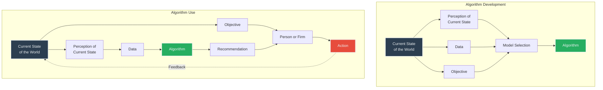

### Key Definitions

#### **Objectives**
- Quantified goals to be optimized
- May be unconscious and imperfectly optimized when used by agents

#### **Model Selection**
- Selection of architecture for ML algorithm class
- Entails assumptions often ignored at deployment
- Examples: OLS regression (linear, structural assumptions) vs Neural Networks (nonlinear, fewer assumptions)

#### **Perception of the World**
- Information available to or inferred by an agent
- No agent has complete understanding
- Different agents have different perceptions

#### **Control Theory for AI Decision Making Systems**

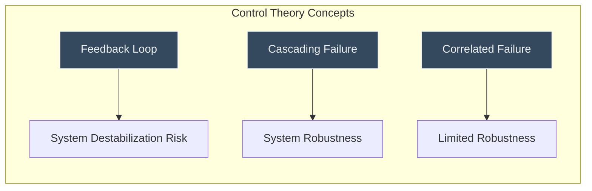

**Key Control Theory Insights:**
- **Feedback**: Actions shape future system states - can compound harm
- **Cascading Failure**: Component failure triggers chain reaction
- **Correlated Failure**: Similar structures lead to widespread impact from single failure type

## 2. Challenges and Interventions - Detailed Analysis

### 2.1 Integrating Experts and Algorithms

**Challenge:** Correlation neglect leads to suboptimal human-AI collaboration

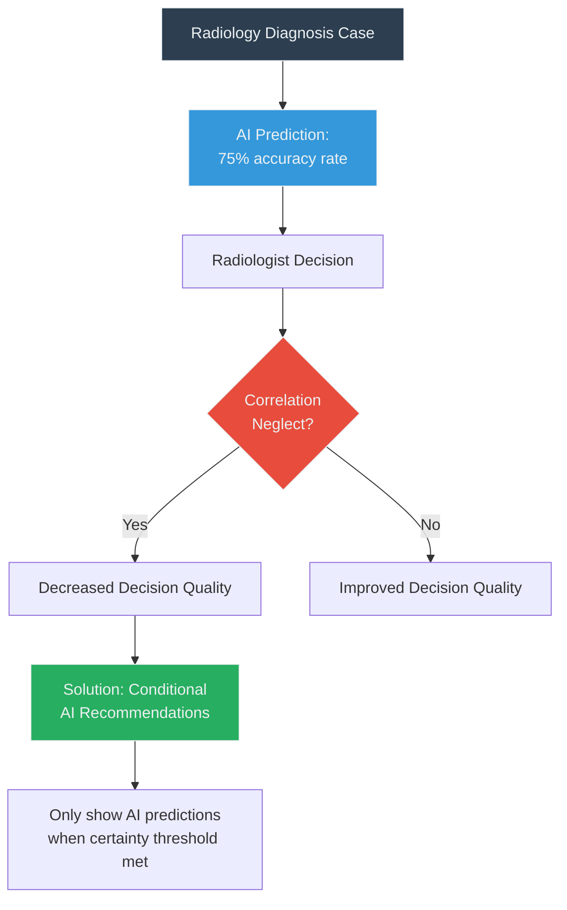

**Example:** Agarwal et al. Radiology Study
- AI more accurate than 75% of radiologists
- BUT: Providing AI predictions had no average effect on accuracy
- **Root Cause:** Radiologists treat AI info as completely new when it's largely repackaged

### 2.2 Algorithmic Monoculture

**Challenge:** Mass adoption of identical algorithms creates systemic risks

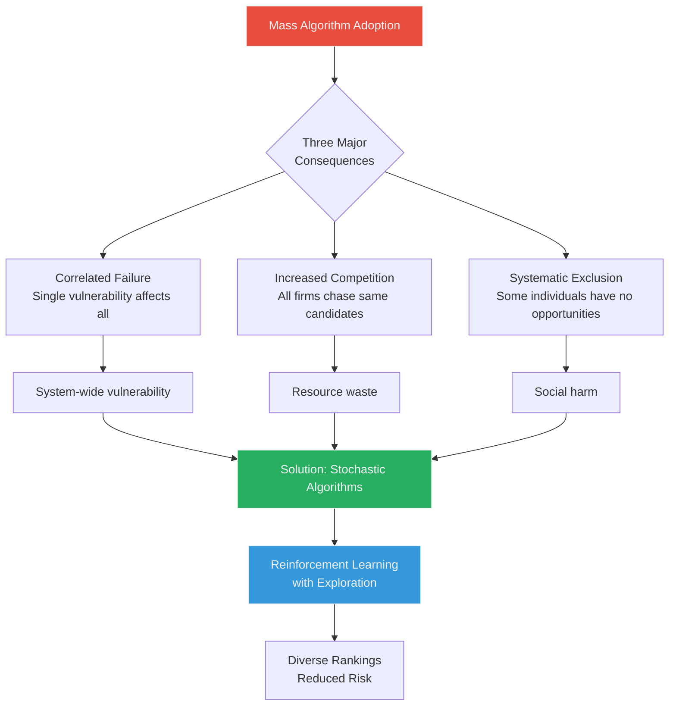

**Example:** Hiring Algorithm Scenario
- 5 firms adopt same algorithm → All compete for same top candidate
- Solution: Add "good noise" through exploration/exploitation balance

### 2.3 Anticompetitive Behavior

**Challenge:** Platform control enables algorithmic manipulation

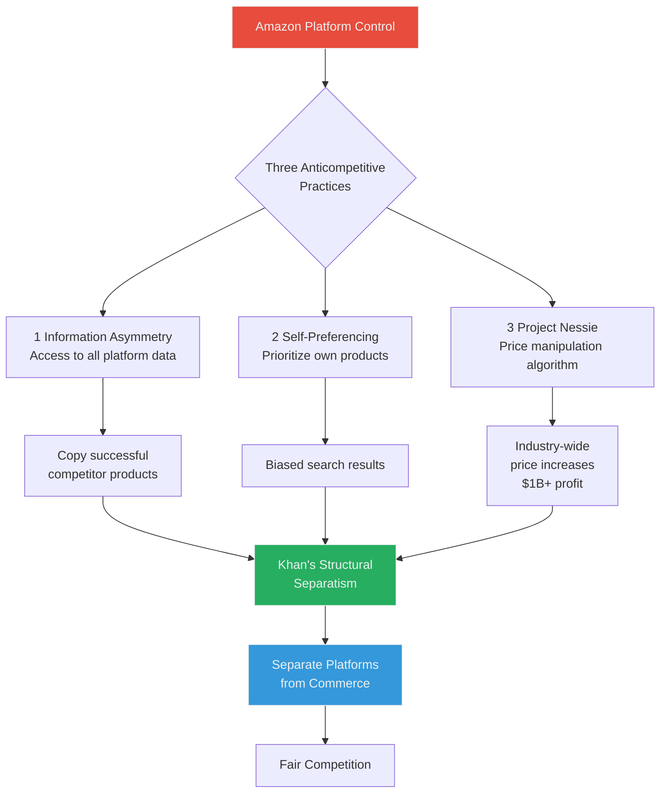

### 2.4 Algorithmic (Mis)alignment

**Challenge:** Proxy objectives create harmful bias

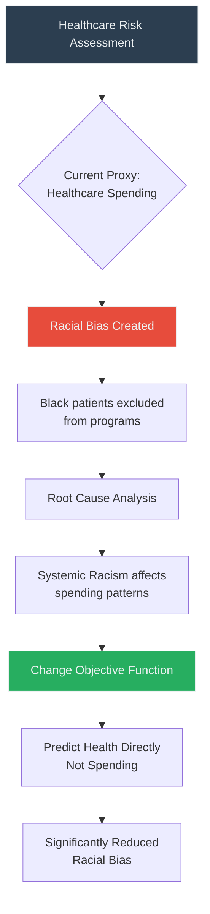

### 2.5 Designing More Effective Objective Functions

**Challenge:** Algorithms replicate human judgment errors

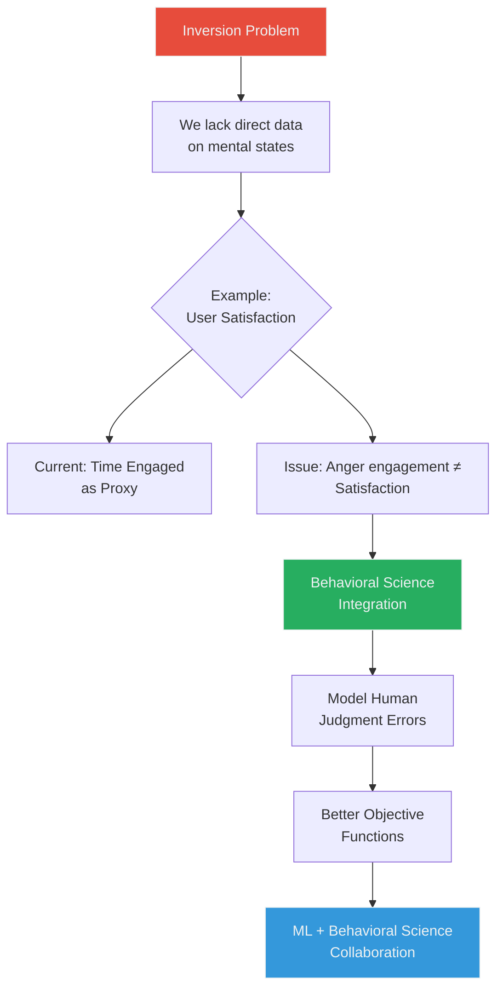

### 2.6 Examining Model Selection

**Challenge:** Limited perception leads to suboptimal outcomes

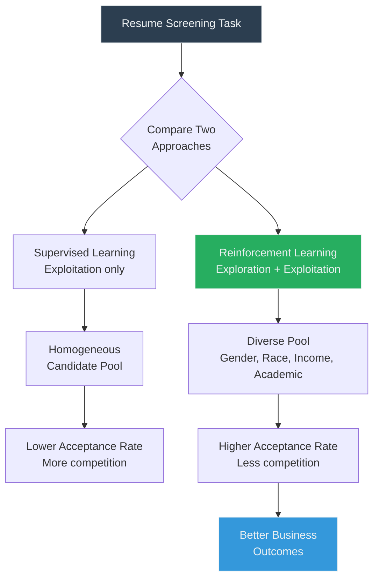

**Example:** Li et al. US Bank Study
- RL algorithm achieved comparable success
- More diverse candidate pool
- Higher offer acceptance rate

### 2.7 Evaluating Models Along Multiple Dimensions

**Challenge:** Single metric evaluation misses improvement opportunities

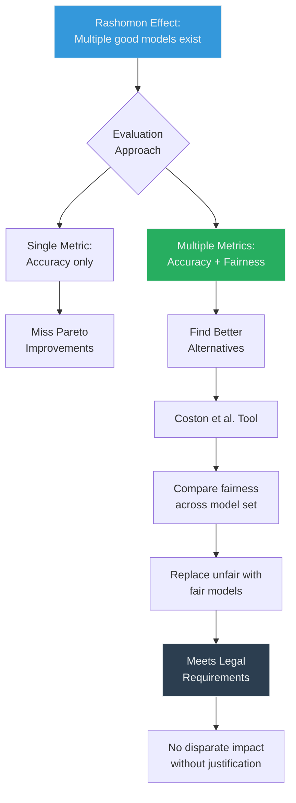

### 2.8 Surprising Results from Out-of-Sample Evaluations

**Challenge:** Debiasing methods fail in deployment

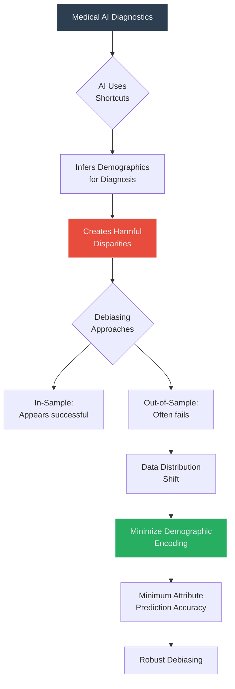

**Example:** Yang et al. Study
- AI uses hospital location as disease predictor
- Debiasing works in training but fails in deployment
- Solution: Remove demographic information from embeddings

### 2.9 Mitigating Bias from Current State of World

**Challenge:** Systemic inequalities perpetuated through "neutral" algorithms

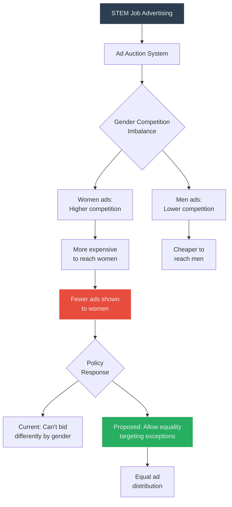

### 2.10 The Importance of Data Selection

**Challenge:** Data choices determine fairness outcomes

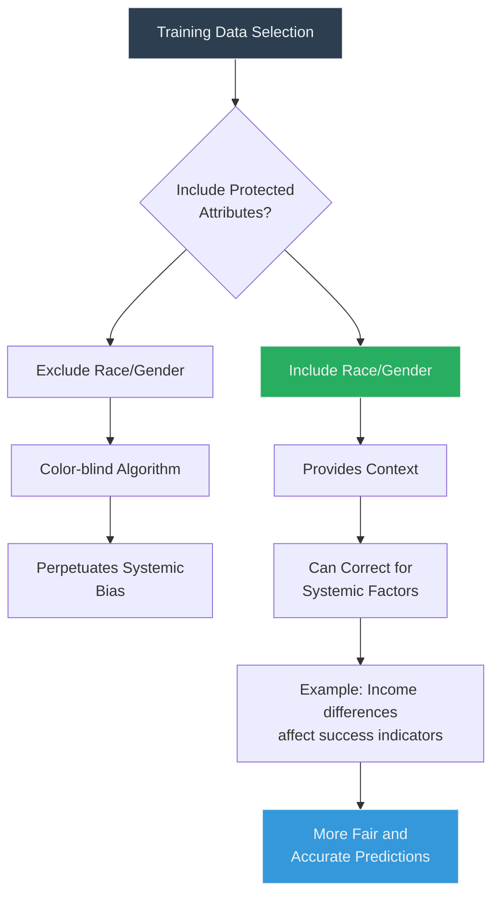

### 2.11 Individual Overrides of Algorithmic Recommendations

**Challenge:** Human override decisions often decrease accuracy

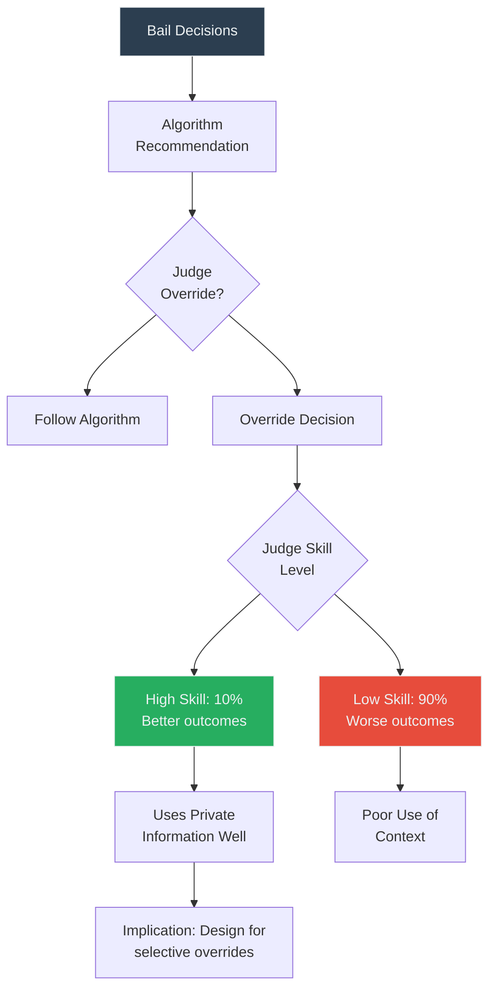

**Example:** Dobbie & Yang Study
- 90% of judge overrides worsen outcomes
- 10% improve outcomes using private information
- High-skill judges use contextual info effectively

## 3. Conclusion

### Key Takeaways

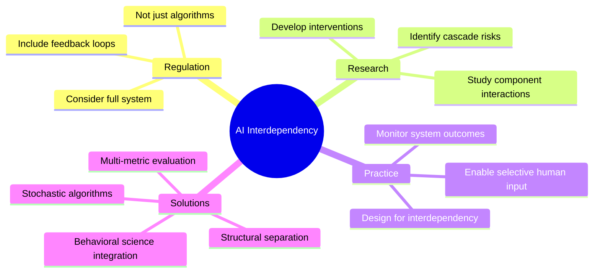

### Core Message

The paper demonstrates that **effective AI governance requires understanding interdependencies** between:
- Algorithm development and deployment
- Human and algorithmic decision-making
- Market dynamics and individual algorithms
- Current world state and future outcomes

**Critical Insight:** Problems in AI systems often arise not from single components but from their interactions. Solutions must therefore address the full system, not isolated parts.

### Regulatory Implications

1. **Move beyond algorithm audits** to system-level assessments
2. **Consider feedback loops** and long-term equilibrium effects
3. **Address market dynamics** not just individual deployments
4. **Enable context-appropriate human oversight**
5. **Recognize that "neutral" algorithms can perpetuate bias**

---

*This comprehensive model empowers stakeholders to identify and address AI problems through understanding system interdependencies rather than focusing on isolated components.*